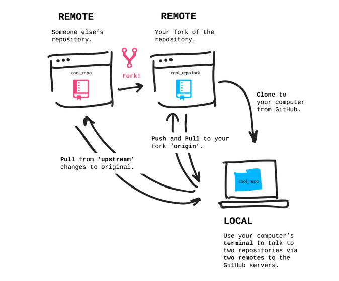
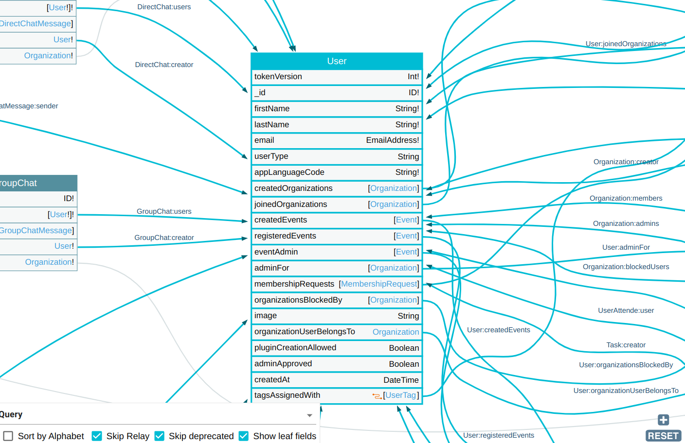

# Contributing to Talawa API

Thank you for your interest in contributing to Talawa API. Regardless of the size of the contribution you make, all contributions are welcome and are appreciated.

If you are new to contributing to open source, please read the Open Source Guides on [How to Contribute to Open Source](https://opensource.guide/how-to-contribute/).

## Table of Contents

<!-- toc -->

- [Code of Conduct](#code-of-conduct)
- [Ways to Contribute](#ways-to-contribute)
  - [Our Development Process](#our-development-process)
    - [Issues](#issues)
    - [Pull Requests](#pull-requests)
    - [Branching Strategy](#branching-strategy)
    - [Conflict Resolution](#conflict-resolution)
  - [Contributing Code](#contributing-code)
- [Upgrading Code](#upgrading-code)
    - [Setting up Upstream and Origin](#setting-up-upstream-and-origin)
    - [Creating a Pull Request - Process Overview](#creating-a-pull-request---process-overview)
- [Type checking and code quality](#type-checking-and-code-quality)
  - [Type checking code files](#type-checking-code-files)
  - [Linting code files](#linting-code-files)
  - [Formatting code files](#formatting-code-files)
  - [Generating Table of Contents](#generating-table-of-contents)
  - [Automation using husky](#automation-using-husky)
    - [Pre-Commit hook](#pre-commit-hook)
    - [Post-Merge hook](#post-merge-hook)
  - [GraphQL Voyager](#graphql-voyager)
  - [GraphQL Markdown](#graphql-markdown)
  - [Running Queries with talawa-api](#running-queries-with-talawa-api)
- [Internships](#internships)
- [Community](#community)

<!-- tocstop -->

## Code of Conduct

A safe environment is required for everyone to contribute. Read our [Code of Conduct Guide](CODE_OF_CONDUCT.md) to understand what this means. Let us know immediately if you have unacceptable experiences in this area.

No one should fear voicing their opinion. Respones must be respectful.

## Ways to Contribute

If you are ready to start contributing code right away, get ready!

1. Join our Slack and introduce yourself. See details on how to join below in the Community section.
   1. This repository has its own dedicated channel.
   1. There are many persons on the various channels who are willing to assist you in getting started.
1. Take a look at our issues (**_after reading our guidelines below_**):
   1. We have a list of [good first issues](https://github.com/PalisadoesFoundation/talawa-api/labels/good%20first%20issue) that contain challenges with a limited scope for beginners.
   1. There are issues for creating tests for our code base. We need to increase reliablility. Try those issues, or create your own for files that don't already have tests. This is another good strategy for beginners.
   1. There are [dormant issues on which nobody has worked for some time](https://github.com/PalisadoesFoundation/talawa-api/issues?q=is%3Aopen+is%3Aissue+label%3Ano-issue-activity). These are another place to start
   1. There may also be [dormant PRs on which nobody has worked for some time](https://github.com/PalisadoesFoundation/talawa-api/issues?q=is%3Aopen+is%3Aissue+label%3Ano-issue-activity+label%3Ano-pr-activity)!
1. Create an issue based on a bug you have found or a feature you would like to add. We value meaningful sugestions and will prioritize them.

Welcome aboard!

### Our Development Process

We utilize GitHub issues and pull requests to keep track of issues and contributions from the community.

#### Issues

Make sure you are following [issue report guidelines](issue-guidelines.md) available here before creating any new issues on Talawa API project.

#### Pull Requests

[Pull Request guidelines](PR_GUIDELINES.md) is best resource to follow to start working on open issues.

#### Branching Strategy

For Talawa API, we had employed the following branching strategy to simplify the development process and to ensure that only stable code is pushed to the `main` branch:

- `develop`: For unstable code and bug fixing
- `main`: Where the stable production ready code lies. This is our default branch.

#### Conflict Resolution

When multiple developers are working on issues there is bound to be a conflict of interest (not to be confused with git conflicts) among issues, PRs or even ideas. Usually these conflicts are resolved in a **First Come First Serve** basis however there are certain exceptions to it.

- In the cases where you feel your potential issues could be an extension or in conflict with other PRs it is important to ask the author of the PR in the slack channel or in their PRs or issues themselves why he/she did not write code for something that would require minimal effort on their part.
- Based on basic courtesy, it is good practice to let the person who created a function apply and test that function when needed.
- Last but not the least, communication is important make sure to talk to other contributors, in these cases, in slack channel or in a issue/PR thread.
- As a last resort the Admins would be responsible for deciding how to resolve this conflict.

### Contributing Code

Code contributions to Talawa come in the form of pull requests. These are done by forking the repo and making changes locally.

Make sure you have read the [Documentation for Setting up the Project](INSTALLATION.md)

The process of proposing a change to Talawa API can be summarized as:

1. Fork the Talawa API repository and branch off `develop`.
1. Your newly forked repository can be cloned locally using `git clone <YOUR FORKED REPO URL>`.
1. Make the Palisadoes Foundation's repo your `git upstream` for your local repo.
1. Make the desired changes to the Talawa API source.
1. Run the app and test your changes.
1. If you've added code, then test suites must be added.
   1. **_General_:**
      1. We need to get to 100% test coverage for the app. We periodically increase the desired test coverage for our pull requests to meet this goal.
      2. Pull requests that don't meet the minimum test coverage levels will not be accepted. This may mean that you will have to create tests for code you did not write. You can decide which part of the code base needs additional tests if this happens to you.
   2. **_Testing_:**
      1. Test using these commands (All tests):
         ```
         npm run test
         genhtml coverage/lcov.info -o coverage
         ```
      2. Test using these commands (Single test):
         ```
         npm run test -- -t <Name_of_Test>
         ```
      3. Here are some useful testing resources:
         1. Documentation:
            1. [Jest testing documentation](https://jestjs.io/docs/expect)
            2. The [organizations.spec.ts](tests/resolvers/Query/organizations.spec.ts) test file is a well documented example of what to do for resolver tests.
         2. Videos:
            1. [Introduction To Testing In JavaScript With Jest](https://www.youtube.com/watch?v=FgnxcUQ5vho)
            2. [Jest Crash Course](https://www.youtube.com/watch?v=7r4xVDI2vho)
            3. [Testing NodeJS applications with JEST](https://www.youtube.com/watch?v=8gHEv5iNRKk)
1. **_Test Code Coverage_:**
   1. _General Information_
      1. The current code coverage of the repo is: [](https://codecov.io/gh/PalisadoesFoundation/talawa-api)
      2. You can determine the percentage test coverage of your code by running these two commands in sequence:
         ```
         npm install
         npm run test
         genhtml coverage/lcov.info -o coverage
         ```
      3. The coverage rate will be visible on the penultimate line of the `genhtml` command's output.
      4. The `genhtml` command is part of the linux `lcov` package. Similar packages can be found for Windows and MacOS.
      5. The currently acceptable coverage rate can be found in the [GitHub Pull Request file](.github/workflows/pull-request.yml). Search for the value below the line containing `min_coverage`.
   2. _Creating your code coverage account_
      1. You can also see your code coverage online for your fork of the repo. This is provided by `codecov.io`
         1. Go to this link: `https://app.codecov.io/gh/XXXX/YYYY` where XXXX is your GitHub account username and YYYY is the name of the repository
         2. Login to `codecov.io` using your GitHub account, and add your **repo** and **branches** to the `codecov.io` dashboard.
         3. Remember to add the `Repository Upload Token` for your forked repo. This can be found under `Settings` of your `codecov.io` account.
         4. Use the value of this token to create a secret named CODE_COV for your forked repo.
         5. You will see your code coverage reports with every push to your repo after following these steps
1. After making changes you can add them to git locally using `git add <file_name>`(to add changes only in a particular file) or `git add .` (to add all changes).
1. After adding the changes you need to commit them using `git commit -m '<commit message>'`(look at the commit guidelines below for commit messages).
1. Once you have successfully commited your changes, you need to push the changes to the forked repo on github using: `git push origin <branch_name>`.(Here branch name must be name of the branch you want to push the changes to.)
1. Now create a pull request to the Talawa repository from your forked repo. Open an issue regarding the same and link your PR to it.
1. Ensure the test suite passes, either locally or on CI once a PR has been created.
1. Review and address comments on your pull request if requested.

## Upgrading Code

Before you start contributing to the repository, you `ALWAYS` need to make sure that your code is up to date with the source repository at `PalisadoesFoundation/talawa-api`.

To do we will help you setup an upstream and origin for your repository, which will help you contribute code with great ease:-

#### Setting up Upstream and Origin

After cloning your forked repository, your origin remote is pointing to your fork (`{{GITHUB USERNAME}}/talawa-api`). To stay up to date with the main `PalisadoesFoundation/talawa-api` repository, add it as a remote called upstream. You'll first need to move into the `talawa-api` directory that was created by the clone operation.

```
$ cd talawa-api
$ git remote add upstream https://github.com/PalisadoesFoundation/talawa-api.git
$ git remote -v
origin     https://github.com/{{GITHUB USERNAME}}/talawa-api.git (fetch)
origin     https://github.com/{{GITHUB USERNAME}}/talawa-api (push)
upstream   https://github.com/PalisadoesFoundation/talawa-api.git (fetch)
upstream   https://github.com/PalisadoesFoundation/talawa-api.git (push)
```

The git remote -v command at the end shows all your current remotes.

Now you can pull in changes from `PalisadoesFoundation/talawa-api` by running `git pull upstream {{branch}}` and push your changes to your fork by running `git push origin {{branch}}`.

We have established a clean setup now. We can make any changes we like and push it to this forked repository, and then make a pull request for getting the changes merged into the original repository. Here's a nice picture explaining the process ([image source](https://github.com/Rafase282/My-FreeCodeCamp-Code/wiki/Lesson-Save-your-Code-Revisions-Forever-with-Git)).



#### Creating a Pull Request - Process Overview

For making any changes to original repository, we first sync our cloned repository with original repository. We merge `develop` with `upstream/develop` to do this.
This may sometimes require a hard reset, and can be done with the following commands:

```
git fetch upstream
git reset upstream/develop --hard
```

Now we make a new branch (with `git checkout -b {{ BRANCH_NAME }}` ), do the changes on the branch, add and commit them (with `git add . && git commit -m {{ COMMIT_MESSAGE }}` ), push the branch to forked repository (with `git push origin {{ BRANCH_NAME }} --force` ), and make a PR from Github interface (from our new branch to the `develop` branch of `PalisadoesFoundation/talawa-api` s).

We use a different branch to make changes so that we can work on multiple issues while still having a clean version in develop branch.

## Type checking and code quality

On making a PR, we use GitHub actions to check that your code is properly formatted, doesn't have typescript type errors and is properly linted. Here are the checks:-

<br/>

### Type checking code files

<br/>

We make use of official typescript compiler(tsc) to check the codebase for type errors.

To check for type errors use this command:-

        npm run typecheck

<br/>

### Linting code files

<br/>

We make use of `eslint` to enforce a strict linting convention in code.

To check code for linting issues use this command:-

        npm run lint:check

To check and fix lint errors in code use this command:-

        npm run lint:fix

Eslint might throw lint errors even after running the `lint:fix` command as those lint errors require manual intervention to be fixed. You have to fix those lint errors manually.

<br/>

### Formatting code files

<br/>

We make use of `prettier` to enforce a strict formatting convention in code.

To check code for formatting issues use this command:-

        npm run format:check

To fix formatting issues in code use this command:-

        npm run format:fix

<br/>

### Generating Table of Contents

To generate table of contents for markdown files use this command:-

```bash
npm run update:toc
```

And if you want to generate table of content for specific file you can use the `markdown-toc` package directly as shown:-

```bash
npx markdown-toc -i README.md
```

Remember to replace `README.md` with the name of the file you want to generate table of contents for.
</br>
For more information on how to use `markdown-toc` package, visit [this link](https://www.npmjs.com/package/markdown-toc).

### Automation using husky

<br/>

We are using the package `Husky` to run git hooks that run according to different git workflows.

<br/>

#### Pre-Commit hook

We run a pre-commit hook which automatically runs code quality checks each time you make a commit and also fixes some of the issues. This way you don't have to run them manually each time.

If you don't want these pre-commit checks running on each commit, you can manually opt out of it using the `--no-verify` flag with your commit message as shown:-

        git commit -m "commit message" --no-verify

<br/>

#### Post-Merge hook

We are also running a post-merge(post-pull) hook which will automatically run "npm install" only if there is any change made to pakage.json file so that the developer has all the required dependencies when pulling files from remote.

If you don't want this hook to run, you can manually opt out of this using the `no verify` flag while using the merge command(git pull):

        git pull --no-verify

<br/>

### GraphQL Voyager

We use the open source project [GraphQL Voyager](https://github.com/IvanGoncharov/graphql-voyager) to help you interact and explore the complete schema in an interactive manner!

Go to `http://localhost:4000/voyager` after running the development server to explore the same!



### GraphQL Markdown

We use the [GraphQL Markdown](https://github.com/exogen/graphql-markdown) project to generate the documentation to describe the schema. To generate the same manually, you first need to start the development server locally with `npm run dev`, and then run the script `npm run generate:graphql-markdown`.

You can then view the [generated documentation here](./talawa-api-docs/modules.md).

While we use a GitHub workflow to update ths schema documentation every time a PR is merged into the repository, it is highly advisable that if you making changes to the schema, then you should also update the schema documentation by the process described above.

### Running Queries with talawa-api

- Talawa API currently implement `GraphQL Playground` as mediator interface to run and test queries directly from the api. [Learn more](https://www.apollographql.com/docs/apollo-server/v2/testing/graphql-playground/)
- In development, Apollo Server enables GraphQL Playground on the same URL as the GraphQL server itself (e.g. http://localhost:4000/graphql) and automatically serves the GUI to web browsers. When NODE_ENV is set to production, GraphQL Playground (as well as introspection) is disabled as a production best-practice.
  
- Note: To access the playground in talawa API append the URL with "/graphql"

## Internships

If you are participating in any of the various internship programs we ar members of then please read the [introduction guides on our documentation website](https://docs.talawa.io/docs/).

## Community

There are many ways to communicate with the community.

1. The Palisadoes Foundation has a Slack channel where members can assist with support and clarification. Visit the [Talawa GitHub repository home page](https://github.com/PalisadoesFoundation/talawa) for the link to join our slack channel.
1. We also have a technical email list run by [freelists.org](https://www.freelists.org/). Search for "palisadoes" and join. Members on this list are also periodically added to our marketing email list that focuses on less technical aspects of our work.
