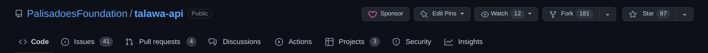
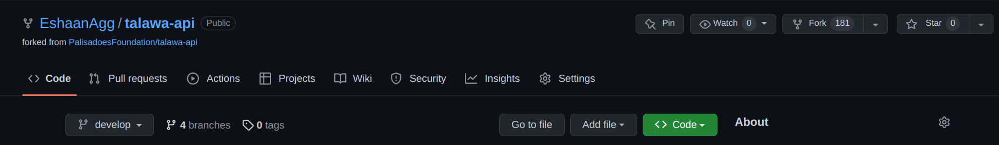
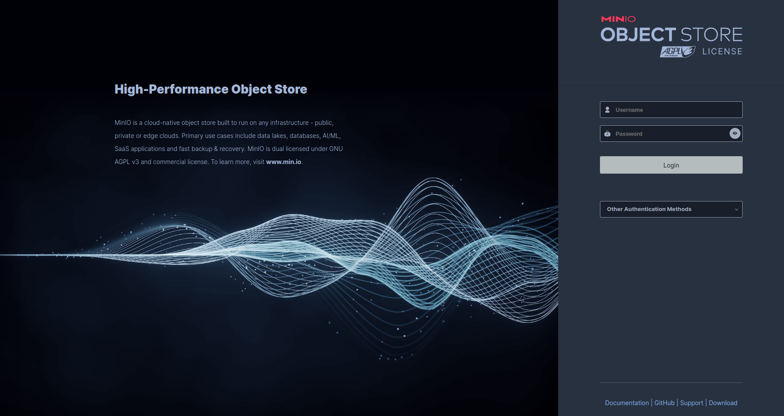
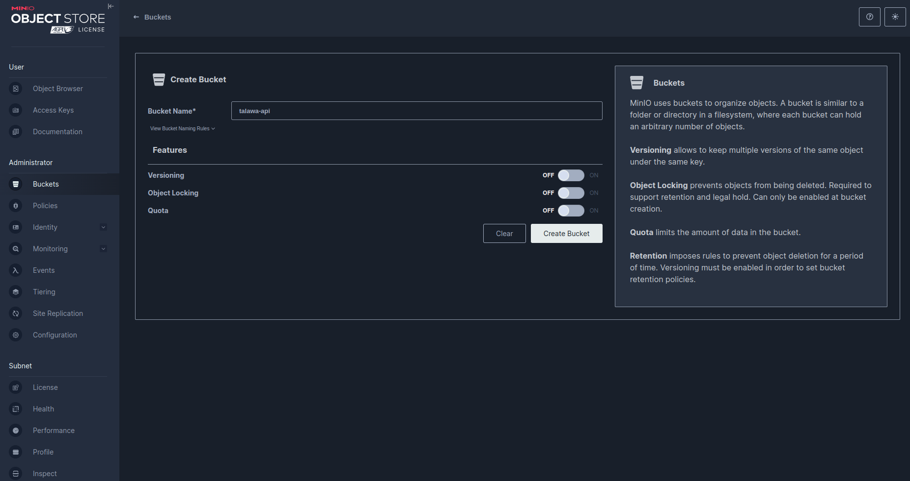
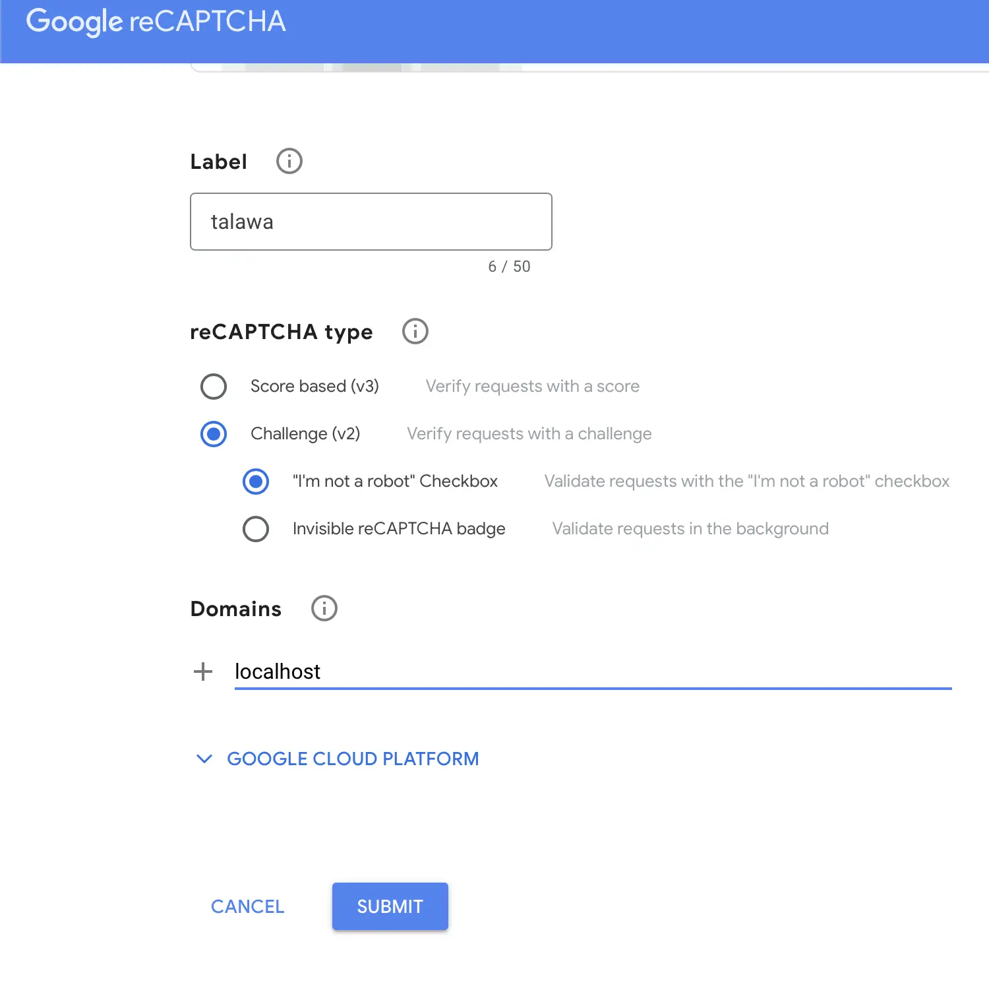
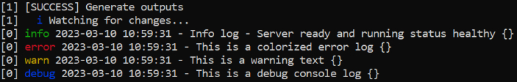
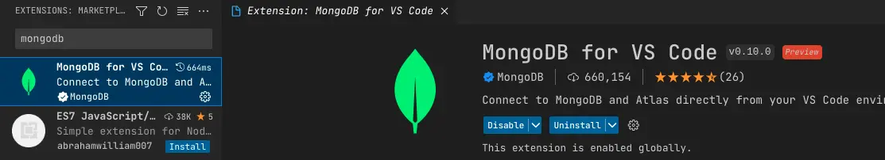
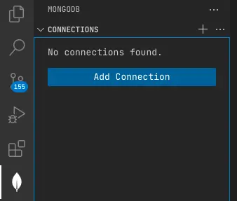
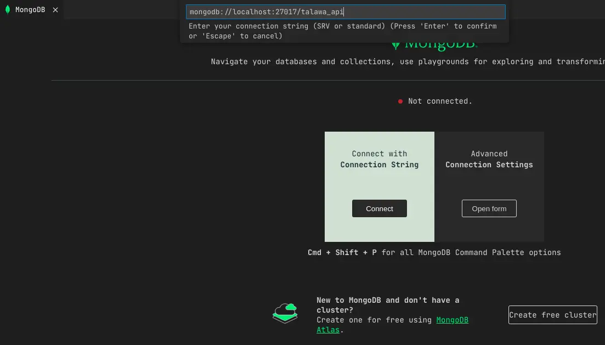
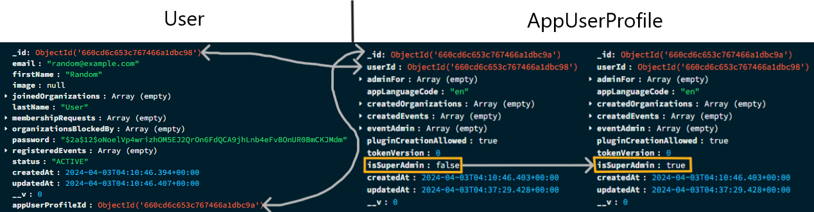

# Talawa-API Installation

This document provides instructions on how to set up and start a running instance of talawa-api on your local system. The instructions are written to be followed in sequence so make sure to go through each of them step by step without skipping any sections.

# Table of Contents

<!-- TOC -->

- [Talawa-API Installation](#talawa-api-installation)
- [Table of Contents](#table-of-contents)
- [Installation Steps Summary](#installation-steps-summary)
- [Prerequisites](#prerequisites)
  - [Install git](#install-git)
  - [Setting up this repository](#setting-up-this-repository)
  - [Install node.js](#install-nodejs)
  - [Install TypeScript](#install-typescript)
  - [Install Required Packages](#install-required-packages)
- [Installation Using Docker](#installation-using-docker)
  - [Run the Talawa-API Setup](#run-the-talawa-api-setup)
  - [Install the Docker Application](#install-the-docker-application)
  - [Docker Compose Setup](#docker-compose-setup)
    - [For Development](#for-development)
    - [For Production](#for-production)
  - [Import The Sample Data](#import-the-sample-data)
- [Installation without Docker](#installation-without-docker)
  - [Install the Required Packages](#install-the-required-packages)
  - [Install MongoDB](#install-mongodb)
    - [Setting up the mongoDB database](#setting-up-the-mongodb-database)
  - [Install Redis](#install-redis)
    - [Performance Benefits](#performance-benefits)
    - [Setting Up Redis](#setting-up-redis)
  - [Set Up MinIO](#set-up-minio)
    - [Install MinIO](#install-minio)
      - [1. Using the Setup Script](#1-using-the-setup-script)
      - [2. Manual MinIO Installation](#2-manual-minio-installation)
    - [Running MinIO with Talawa-API](#running-minio-with-talawa-api)
      - [1. Using Docker](#1-using-docker)
      - [2. Running Locally](#2-running-locally)
    - [Access MinIO](#access-minio)
    - [Create a Bucket](#create-a-bucket)
- [Configuration](#configuration)
  - [Automated Configuration of `.env`](#automated-configuration-of-env)
  - [Manual Configuration of `.env`](#manual-configuration-of-env)
    - [The Environment Variables in `.env`](#the-environment-variables-in-env)
    - [Changing the Development Environment in the .env file](#changing-the-development-environment-in-the-env-file)
    - [Generating Token Secrets](#generating-token-secrets)
      - [Setting up ACCESS_TOKEN_SECRET in the .env file](#setting-up-access_token_secret-in-the-env-file)
        - [Linux](#linux)
        - [Windows](#windows)
    - [Setting up REFRESH_TOKEN_SECRET in the .env file](#setting-up-refresh_token_secret-in-the-env-file)
    - [Configuring MongoDB in the .env file](#configuring-mongodb-in-the-env-file)
      - [Using the CLI to get the MONGODB_URL Connection String](#using-the-cli-to-get-the-mongodb_url-connection-string)
      - [Using Microsoft Windows to get the MONGODB_URL Connection String](#using-microsoft-windows-to-get-the-mongodb_url-connection-string)
    - [Configuring Redis in .env file](#configuring-redis-in-env-file)
      - [For Local Setup (Linux and WSL)](#for-local-setup-linux-and-wsl)
      - [For Remote Setup (Redis Cloud)](#for-remote-setup-redis-cloud)
    - [Setting up .env LAST_RESORT_SUPERADMIN_EMAIL parameter in the .env file](#setting-up-env-last_resort_superadmin_email-parameter-in-the-env-file)
    - [Configuring Google ReCAPTCHA in the .env file](#configuring-google-recaptcha-in-the-env-file)
      - [Setting up the RECAPTCHA_SECRET_KEY](#setting-up-the-recaptcha_secret_key)
      - [Setting up .env MAIL_USERNAME and MAIL_PASSWORD ReCAPTCHA Parameters](#setting-up-env-mail_username-and-mail_password-recaptcha-parameters)
    - [Setting up SMTP Email Variables in the .env File](#setting-up-smtp-email-variables-in-the-env-file)
    - [Setting up MinIO configurations](#setting-up-minio-configurations)
    - [Setting up Logger configurations](#setting-up-logger-configurations)
      - [Setting up COLORIZE_LOGS in .env file](#setting-up-colorize_logs-in-env-file)
      - [Setting up LOG_LEVEL in .env file](#setting-up-log_level-in-env-file)
- [Importing Sample Database](#importing-sample-database)
  - [Syntax:](#syntax)
  - [Examples:](#examples)
  - [Sample Data Overview:](#sample-data-overview)
    - [User Accounts and Organizations:](#user-accounts-and-organizations)
    - [Posts](#posts)
    - [Events](#events)
- [Running Talawa-API](#running-talawa-api)
- [How to Access the Talawa-API URL](#how-to-access-the-talawa-api-url)
  - [For Talawa-API Developers](#for-talawa-api-developers)
  - [For Mobile App Developers](#for-mobile-app-developers)
    - [On Android Virtual Device](#on-android-virtual-device)
    - [On a Real Mobile Device](#on-a-real-mobile-device)
  - [For Talawa-Admin Developers](#for-talawa-admin-developers)
- [Accessing MongoDB](#accessing-mongodb)
  - [Managing MongoDB using the MongoDB Compass GUI](#managing-mongodb-using-the-mongodb-compass-gui)
  - [Managing MongoDB using the VSCode extension](#managing-mongodb-using-the-vscode-extension)
- [Manually Adding The First Super Admin User](#manually-adding-the-first-super-admin-user)
  - [Using MongoDB Compass](#using-mongodb-compass)
  - [Using Mongo Shell](#using-mongo-shell)
- [Other](#other)
  - [Changing default talawa-api port](#changing-default-talawa-api-port)
- [Testing](#testing)

<!-- toc -->

- [Installation Steps Summary](#installation-steps-summary)
- [Prerequisites](#prerequisites)
  - [Install git](#install-git)
  - [Setting up this repository](#setting-up-this-repository)
  - [Install node.js](#install-nodejs)
  - [Install TypeScript](#install-typescript)
  - [Install Required Packages](#install-required-packages)
- [Installation Using Docker](#installation-using-docker)
  - [Run the Talawa-API Setup](#run-the-talawa-api-setup)
  - [Install the Docker Application](#install-the-docker-application)
  - [Docker Compose Setup](#docker-compose-setup)
  - [Prerequisites](#prerequisites-1)
    - [For Development](#for-development)
    - [For Production](#for-production)
    - [Congratulations! 🎉 Your Talawa API is now successfully set up and running using Docker!](#congratulations-%F0%9F%8E%89-your-talawa-api-is-now-successfully-set-up-and-running-using-docker)
  - [Import The Sample Data](#import-the-sample-data)
- [Installation without Docker](#installation-without-docker)
  - [Install the Required Packages](#install-the-required-packages)
  - [Install MongoDB](#install-mongodb)
    - [Setting up the mongoDB database](#setting-up-the-mongodb-database)
  - [Install Redis](#install-redis)
    - [Performance Benefits](#performance-benefits)
    - [Setting Up Redis](#setting-up-redis)
  - [Set Up MinIO](#set-up-minio)
    - [Install MinIO](#install-minio)
      - [1. Using the Setup Script](#1-using-the-setup-script)
      - [2. Manual MinIO Installation](#2-manual-minio-installation)
    - [Running MinIO with Talawa-API](#running-minio-with-talawa-api)
      - [1. Using Docker](#1-using-docker)
      - [2. Running Locally](#2-running-locally)
    - [Customize MinIO Data Directory](#customize-minio-data-directory)
    - [Access MinIO](#access-minio)
    - [Create a Bucket](#create-a-bucket)
- [Configuration](#configuration)
  - [Automated Configuration of `.env`](#automated-configuration-of-env)
  - [Manual Configuration of `.env`](#manual-configuration-of-env)
    - [The Environment Variables in `.env`](#the-environment-variables-in-env)
    - [Changing the Development Environment in the .env file](#changing-the-development-environment-in-the-env-file)
    - [Generating Token Secrets](#generating-token-secrets)
      - [Setting up ACCESS_TOKEN_SECRET in the .env file](#setting-up-access_token_secret-in-the-env-file)
        - [Linux](#linux)
        - [Windows](#windows)
    - [Setting up REFRESH_TOKEN_SECRET in the .env file](#setting-up-refresh_token_secret-in-the-env-file)
    - [Configuring MongoDB in the .env file](#configuring-mongodb-in-the-env-file)
      - [Using the CLI to get the MONGODB_URL Connection String](#using-the-cli-to-get-the-mongodb_url-connection-string)
      - [Using Microsoft Windows to get the MONGODB_URL Connection String](#using-microsoft-windows-to-get-the-mongodb_url-connection-string)
    - [Configuring Redis in .env file](#configuring-redis-in-env-file)
      - [For Local Setup (Linux and WSL)](#for-local-setup-linux-and-wsl)
      - [For Remote Setup (Redis Cloud)](#for-remote-setup-redis-cloud)
    - [Setting up .env LAST_RESORT_SUPERADMIN_EMAIL parameter in the .env file](#setting-up-env-last_resort_superadmin_email-parameter-in-the-env-file)
    - [Configuring Google ReCAPTCHA in the .env file](#configuring-google-recaptcha-in-the-env-file)
      - [Setting up the RECAPTCHA_SECRET_KEY](#setting-up-the-recaptcha_secret_key)
      - [Setting up .env MAIL_USERNAME and MAIL_PASSWORD ReCAPTCHA Parameters](#setting-up-env-mail_username-and-mail_password-recaptcha-parameters)
    - [Setting up SMTP Email Variables in the .env File](#setting-up-smtp-email-variables-in-the-env-file)
    - [Setting up MinIO configurations](#setting-up-minio-configurations)
    - [Setting up Logger configurations](#setting-up-logger-configurations)
      - [Setting up COLORIZE_LOGS in .env file](#setting-up-colorize_logs-in-env-file)
      - [Setting up LOG_LEVEL in .env file](#setting-up-log_level-in-env-file)
- [Importing Sample Database](#importing-sample-database)
  - [Syntax:](#syntax)
  - [Examples:](#examples)
  - [Sample Data Overview:](#sample-data-overview)
    - [User Accounts and Organizations:](#user-accounts-and-organizations)
    - [Posts](#posts)
    - [Events](#events)
- [Running Talawa-API](#running-talawa-api)
- [How to Access the Talawa-API URL](#how-to-access-the-talawa-api-url)
  - [For Talawa-API Developers](#for-talawa-api-developers)
  - [For Mobile App Developers](#for-mobile-app-developers)
    - [On Android Virtual Device](#on-android-virtual-device)
    - [On a Real Mobile Device](#on-a-real-mobile-device)
  - [For Talawa-Admin Developers](#for-talawa-admin-developers)
- [Accessing MongoDB](#accessing-mongodb)
  - [Managing MongoDB using the MongoDB Compass GUI](#managing-mongodb-using-the-mongodb-compass-gui)
  - [Managing MongoDB using the VSCode extension](#managing-mongodb-using-the-vscode-extension)
- [Manually Adding The First Super Admin User](#manually-adding-the-first-super-admin-user)
  - [Using MongoDB Compass](#using-mongodb-compass)
  - [Using Mongo Shell](#using-mongo-shell)
- [Other](#other)
  - [Changing default talawa-api port](#changing-default-talawa-api-port)
- [Testing](#testing)

<!-- tocstop -->

# Installation Steps Summary

Installation is not difficult, but there are many steps. This is a brief explanation of what needs to be done:

1. Install `git`
2. Download the code from GitHub using `git`
3. Install `node.js` (Node), the runtime environment the application will need to work.
4. Configure the Node Package Manager (`npm`) to automatically use the correct version of Node for our application.
5. Use `npm` to install TypeScript, the language the application is written in.
6. Install other supporting software such as the database using either:
   1. Docker
   2. A manual setup
7. Configure the application
8. Start the application

These steps are explained in more detail in the sections that follow.

# Prerequisites

In this section we'll explain how to set up all the prerequisite software packages to get you up and running.

## Install git

The easiest way to get the latest copies of our code is to install the `git` package on your computer.

Follow the setup guide for `git` on official [git docs](https://git-scm.com/downloads). Basic `git` knowledge is required for open source contribution so make sure you're comfortable with it. [Here's](https://youtu.be/apGV9Kg7ics) a good tutorial to get started with `git` and `github`.

## Setting up this repository

First you need a local copy of `talawa-api`. Run the following command in the directory of choice on your local system.

1. On your computer, navigate to the folder where you want to setup the repository.
2. Open a `cmd` (Windows) or `terminal` (Linux or MacOS) session in this folder.
   1. An easy way to do this is to right-click and choose appropriate option based on your OS.
3. **For Our Open Source Contributor Software Developers:**

   1. Next, we'll fork and clone the `talawa-api` repository.
   1. In your web browser, navigate to [https://github.com/PalisadoesFoundation/talawa-api/](https://github.com/PalisadoesFoundation/talawa-api/) and click on the `fork` button. It is placed on the right corner opposite the repository name `PalisadoesFoundation/talawa-api`.

      

   1. You should now see `talawa-api` under your repositories. It will be marked as forked from `PalisadoesFoundation/talawa-api`

      

   1. Clone the repository to your local computer (replacing the values in `{{}}`):
      ```bash
      $ git clone https://github.com/{{YOUR GITHUB USERNAME}}/talawa-api.git
      cd talawa-api
      git checkout develop
      ```
      - **Note:** Make sure to check out the `develop` branch
   1. You now have a local copy of the code files. For more detailed instructions on contributing code, and managing the versions of this repository with `git`, checkout our [CONTRIBUTING.md](./CONTRIBUTING.md) file.

4. **Talawa Administrators:**

   1. Clone the repository to your local computer using this command:

      ```bash
      $ git clone https://github.com/PalisadoesFoundation/talawa-api.git
      ```

## Install node.js

Best way to install and manage `node.js` is making use of node version managers. We recommend using `fnm`, which will be described in more detail later.

Follow these steps to install the `node.js` packages in Windows, Linux and MacOS.

1. For Windows:
   1. first install `node.js` from their website at https://nodejs.org
      1. When installing, don't click the option to install the `necessary tools`. These are not needed in our case.
   2. then install [fnm](https://github.com/Schniz/fnm). Please read all the steps in this section first.
      1. All the commands listed on this page will need to be run in a Windows terminal session in the `talawa-api` directory.
      2. Install `fnm` using the `winget` option listed on the page.
      3. Setup `fnm` to automatically set the version of `node.js` to the version required for the repository using these steps:
         1. First, refer to the `fnm` web page's section on `Shell Setup` recommendations.
         2. Open a `Windows PowerShell` terminal window
         3. Run the recommended `Windows PowerShell` command to open `notepad`.
         4. Paste the recommended string into `notepad`
         5. Save the document.
         6. Exit `notepad`
         7. Exit PowerShell
         8. This will ensure that you are always using the correct version of `node.js`
2. For Linux and MacOS, use the terminal window.
   1. install `node.js`
   2. then install `fnm`
      1. Refer to the installation page's section on the `Shell Setup` recommendations.
      2. Run the respective recommended commands to setup your node environment
      3. This will ensure that you are always using the correct version of `node.js`

## Install TypeScript

TypeScript is a typed superset of JavaScript that compiles to plain JavaScript. It adds optional types, classes, and modules to JavaScript, and supports tools for large-scale JavaScript applications.

To install TypeScript, you can use the `npm` command which comes with `node.js`:

```bash
npm install -g typescript
```

This command installs TypeScript globally on your system so that it can be accessed from any project.

## Install Required Packages

Run the following command to install the packages and dependencies required by the app:

```
npm install
```

The prerequisites are now installed. The next step will be to get the app up and running.

# Installation Using Docker

This guide provides step-by-step instructions on deploying a talawa-api using Docker. Docker allows you to package your application and its dependencies into a container, providing a consistent environment across different systems.

Here is a list of steps to follow:

1. Run the application setup procedure
2. Install the Docker application
3. Install the Docker helper
4. Install other supporting software such as the database using the `docker-compose` command.
5. Start Docker using the `docker-compose` command
6. Import the sample data into the database

## Run the Talawa-API Setup

We have created a setup script to make configuring Talawa-API easier.

1. You can do this by running the command below.
2. Default answers will be given with capital letters
3. Details of what each prompt means can be found in the [Configuration](#configuration) section of this document.

```
npm run setup
```

## Install the Docker Application

There are many ways to install Docker. We reccommend using Docker Desktop. It can be downloaded here:

- Download [Docker Desktop](https://www.docker.com/products/docker-desktop) using this link.

## Docker Compose Setup

## Prerequisites

- [Docker Desktop](https://www.docker.com/products/docker-desktop) installed on your machine.

After installing Docker, you'll need to tell Docker to install the additional software it will need to run the application.

The setup steps differ depending on whether you are working in a development or production environment.

### For Development

Follow these steps for setting up a software development environment.

1. Building and Starting Development Containers:

   1. Using Windows:

      ```bash
      docker-compose -f docker-compose.dev.yaml up --build
      ```

   2. Using Ubuntu: 1. Running synchronously. Using CTRL-C will stop it.
      `bash
         sudo /usr/libexec/docker/cli-plugins/docker-compose -f docker-compose.dev.yaml up --build
         ` 2. Running asynchronously in a subshell. You will have to use the `docker-compose down` command below to stop it.
      `bash
sudo /usr/libexec/docker/cli-plugins/docker-compose -f docker-compose.dev.yaml up --build &
`
      This command starts the development environment, where you can make changes to the code, and the server will automatically restart.

2. Accessing the Development Application: Open your web browser and navigate to:

   ```
   http://localhost:4000
   ```

3. Stopping Development Containers:

   1. Using Windows:

      ```
      docker-compose -f docker-compose.dev.yaml down
      ```

   2. Using Ubuntu:

      ```
      sudo /usr/libexec/docker/cli-plugins/docker-compose -f docker-compose.dev.yaml down
      ```

### For Production

Follow these steps for setting up a production environment.

1. Building and Starting Production Containers:

   ```
   docker-compose -f docker-compose.prod.yaml up --build -d
   ```

   This command starts the production environment in detached mode, suitable for production deployment.

2. Accessing the Production Application:Open your web browser and navigate to:

   ```
   http://localhost:4001
   ```

3. Stopping Production Containers:
   ```
   docker-compose -f docker-compose.prod.yaml down
   ```

### Congratulations! 🎉 Your Talawa API is now successfully set up and running using Docker!

**Note: If you're using Docker, you'll need to manually import the sample data after the Docker Compose has started the MongoDB container. For instructions on how to do this, refer to [Importing Sample Database](#importing-sample-database)**

## Import The Sample Data

You'll need to manually import the sample data after the Docker Compose has started the MongoDB container. For instructions on how to do this, refer to the [Importing Sample Database](#importing-sample-database) section of this document.

# Installation without Docker

There are more steps, but the outcome is the same. A working Talawa-API instance.

## Install the Required Packages

Install the packages required by `talawa-api` using this command:

```
npm install
```

## Install MongoDB

Talawa-api makes use of `MongoDB` for its database needs. We make use of `mongoose ODM` to interact with the MongoDB database from within the code.

### Setting up the mongoDB database

We're listing some common approaches to set up a running instance of MongoDB database:

1. `System native database approach:` (Highly Recommended) You can install MongoDB natively on your system and create/connect to the database. Follow the setup guide on official [MongoDB Docs](https://www.mongodb.com/docs/manual/administration/install-community/) for your respective operating system.
2. `Hosted database approach:` MongoDB Atlas is the easiest way to get a running instance of mongodb database. It is a hosted(remote) mongodb database provided by mongodb itself. If you're a beginner and don't want too much of a hassle setting up the database you should use this approach but you should eventually switch to local instance. Follow the setup guide on official [MongoDB Atlas Docs](https://www.mongodb.com/docs/atlas/getting-started/). Mongodb Atlas is just one of the many hosted database solutions. Some issues that you might face while using this are slower tests, slower API requests, dependence on Internet connection etc.
3. `Docker container approach:` If you are fluent in working with docker you should use this approach. Docker is a great way to manage and run applications without natively installing anything on your system. With this you can set up the mongodb database inside a docker container and manage it as per your will. Follow this [video tutorial](https://www.youtube.com/watch?v=uklyCSKQ1Po) to set up a mongodb docker container. You can learn about docker from [Docker docs](https://docs.docker.com/).

## Install Redis

Talawa-api makes use of `Redis` for caching frequently accessed data items in the primary database. We make use of `ioredis` to interact with the `redis-server` from within the code. The main Idea is the in production this will act as an in-memory cache. So it is recommended that you set it up locally. However for simplicity purposes, a section to accommodate for setting Redis up using a remote instance like Redis Cloud has been added. Please note that this is not recommended since the remote connection takes a considerable amount of time to be considered as a cache to improve application performance.

### Performance Benefits


### Setting Up Redis

1. `For Linux Users`: If you are using a Linux distribution, follow these steps to set up Redis:

   1. Open a terminal.

   2. Update the package list:

      ```bash
      sudo apt update
      ```

   3. Install Redis Server:

      ```bash
      sudo apt install redis-server
      ```

   4. Start the Redis service:

      ```bash
      sudo service redis-server start
      ```

   5. Test if Redis is running by running the Redis CLI:
      ```bash
      redis-cli
      ```
   6. Use these parameters when running the setup script if you have configured the server on your local machine:
      1. Redis Host: `localhost`
      1. Redis Port: `6379` (default Redis port)

2. `For Windows Users using WSL`: If you'd rather not deal with the hassle of setting up WSL on your computer, there's another option: you can use a hosted database like Redis Cloud. More details about this are provided below, mainly for when you're working on development tasks. But it's a good idea to set up Redis on your own computer if you can. Right now, Redis isn't supported directly on Windows – you can only install and use it through WSL. If you're a Windows user and want to get Redis working using the Windows Subsystem for Linux (WSL), just follow these steps:

   1. Install WSL (Windows Subsystem for Linux) following the official [WSL Installation Guide](https://docs.microsoft.com/en-us/windows/wsl/install).

   2. Open a WSL terminal.

   3. Update the package list:

      ```bash
      sudo apt update
      ```

   4. Install Redis Server:

      ```bash
      sudo apt install redis-server
      ```

   5. Start the Redis service:

      ```bash
      sudo service redis-server start
      ```

   6. Test if Redis is running by running the Redis CLI:

      ```bash
      redis-cli
      ```

   7. Use these parameters when running the setup script if you have configured the server on your local machine:
      1. Redis Host: `localhost`
      2. Redis Port: `6379` (default Redis port)

3. **Connecting to Redis Cloud**:

   To connect to a Redis cloud service, you will need the host and port information provided by your cloud service provider. Use these values in your application to establish a connection. Typically, the host and port strings are provided in the following format:

   1. Host: `your-redis-host.redisprovider.com`
   1. Port: `6379` (default Redis port)

   Replace `your-redis-host.redisprovider.com` with the actual host provided by your Redis cloud service. You can then use these values in your application's configuration to connect to your Redis cloud instance. You may also have to enter Redis Password and Username for using cloud instance.

Remember to adjust any paths or details as needed for your specific environment. After following these steps, you will have successfully set up Redis.

## Set Up MinIO

Talawa-API uses MinIO, an open-source object storage system, for storing uploaded files. MinIO will be hosted alongside Talawa-API itself, providing a self-contained solution for file storage.

### Install MinIO

You can either use the setup script for automatic configuration or install MinIO manually.

#### 1. Using the Setup Script

1. Run the setup script.
2. The script will automatically set up environment variables, including MinIO credentials.

   Details of what each prompt means can be found in the [Configuration](#configuration) section of this document.

   ```bash
   npm run setup
   ```

#### 2. Manual MinIO Installation

If you choose to set up MinIO manually, follow the instructions for your operating system below. Note that the MinIO server should not be started manually as it will be handled by the Talawa-API.

1. For Linux Users

   - Download and Install MinIO
     ```bash
     wget https://dl.min.io/server/minio/release/linux-amd64/archive/minio_20240817012454.0.0_amd64.deb -O minio.deb
     sudo dpkg -i minio.deb
     ```
   - Follow the official installation guide: [MinIO Installation Guide for Linux](https://min.io/docs/minio/linux/index.html)

2. For Windows Users

   - Download and Install MinIO
     ```
     https://dl.min.io/server/minio/release/windows-amd64/minio.exe
     ```
   - Follow the official installation guide: [MinIO Installation Guide for Windows](https://min.io/docs/minio/windows/index.html)

3. For macOS Users
   - Download and Install MinIO
     ```bash
     brew install minio/stable/minio
     ```
   - Follow the official installation guide: [MinIO Installation Guide for macOS](https://min.io/docs/minio/macos/index.html)

### Running MinIO with Talawa-API

You can run MinIO alongside Talawa-API using Docker or locally. Both methods ensure that MinIO is set up and running with Talawa-API.

#### 1. Using Docker

To run MinIO along with Talawa-API using Docker, use the following command:

```bash
docker compose -f <docker-compose-file-name> up
```

Replace `<docker-compose-file-name>` with the name of the Docker Compose file. This command will start both the Talawa-API and MinIO services as defined in the Docker Compose file.

#### 2. Running Locally

If you prefer to run MinIO and Talawa-API locally, use the provided npm scripts. These scripts will ensure that MinIO is installed (if not already) and start the Talawa-API server along with MinIO.

- To run the development server with MinIO:

  ```bash
  npm run dev:with-minio
  ```

- To start the production server with MinIO:

  ```bash
  npm run start:with-minio
  ```

These npm scripts will check if MinIO is installed on your system. If MinIO is not installed, the scripts will install it automatically before starting the Talawa-API server.

### Customize MinIO Data Directory

You can customize the local storage path for MinIO in one of the following ways:

1. **Using the Setup Script**: During the configuration process, the setup script allows you to specify a custom path for MinIO's local data directory. Follow the prompts to set `MINIO_DATA_DIR` to your desired path.

2. **Manually Editing the .env File**: Directly modify the `MINIO_DATA_DIR` environment variable in the `.env` file to point to a different directory for storing MinIO's data.

### Access MinIO

- **MinIO Server:**

  - If using Docker, the server will be accessible at `http://minio:9000`.
  - If not using Docker, the server will be accessible at `http://localhost:9000`.

- **MinIO Console (Web UI):** Access the console at `http://localhost:9001`.

  

### Create a Bucket

After logging into the MinIO web UI, create a bucket with the name specified in your `.env` file under the `MINIO_BUCKET` variable.



# Configuration

It's important to configure Talawa-API to complete it's setup.

A configuration file named `.env` is required in the root directory of `Talawa-API` for storing environment variables used at runtime. It is not a part of the repo and you will have to create it.

## Automated Configuration of `.env`

You can use our interactive setup script to populate the `.env` file using the command below.

This will create a new `.env` file for you, and if one already exists, it will make the updates you require.

```
npm run setup
```

It can be done manually as well and here's how to do it.

## Manual Configuration of `.env`

**NOTE:** Use the steps below if you decided not to use the automated configuration approach.

With a fresh installation, you will not see a `.env` file present. To manually create one, you will need to copy the contents of the `.env.sample` file provided to `.env`.

Use this command to do this

```
cp .env.sample .env
```

### The Environment Variables in `.env`

This `.env` file must be populated with the following environment variables for talawa-api to work:

| Variable                     | Description                                                               |
| ---------------------------- | ------------------------------------------------------------------------- |
| NODE_ENV                     | Used for providing the environment in which the the talawa-api is running |
| SERVER_PORT                  | Used for specifying the port on which the talawa-api is running           |
| ACCESS_TOKEN_SECRET          | Used for signing/verifying JWT tokens                                     |
| REFRESH_TOKEN_SECRET         | Used for signing/verifying JWT tokens                                     |
| MONGO_DB_URL                 | Used for connecting talawa-api to the mongoDB database                    |
| RECAPTCHA_SECRET_KEY         | Used for authentication using reCAPTCHA                                   |
| RECAPTCHA_SITE_KEY           | Used for authentication using reCAPTCHA                                   |
| MAIL_USERNAME                | Used for mailing service                                                  |
| MAIL_PASSWORD                | Used for mailing service                                                  |
| LAST_RESORT_SUPERADMIN_EMAIL | Used for promoting the default super admin                                |
| COLORIZE_LOGS                | Used for colorized log formats in console                                 |
| LOG_LEVEL                    | Used for setting the logging level                                        |
| REDIS HOST                   | Used for connecting talawa-api to the redis instance                      |
| REDIS_PORT                   | Specifies the port of the active redis-server                             |
| REDIS_PASSWORD(optional)     | Used for authenticating the connection request to                         |
|                              | a hosted redis-server                                                     |
| MINIO_ENDPOINT               | Used for connecting talawa-api to the MinIO storage.                      |
| MINIO_ROOT_USER              | Used to authenticate with the MinIO server.                               |
| MINIO_ROOT_PASSWORD          | Used to authenticate with the MinIO server.                               |
| MINIO_BUCKET                 | Used for the bucket name in the MinIO storage.                            |
| MINIO_DATA_DIR               | Defines the local directory path for MinIO storage.                       |

The following sections will show you how to configure each of these parameters.

### Changing the Development Environment in the .env file

Change the `NODE_ENV` environment variable in the `.env` file from `production` to `development`:

```
NODE_ENV=development
```

### Generating Token Secrets

Access and refresh token secrets are used for authentication purposes.

#### Setting up ACCESS_TOKEN_SECRET in the .env file

Run the following command and copy/paste the result to the variable named `ACCESS_TOKEN_SECRET` in `.env` file.

##### Linux

The command to use is:

```
openssl rand -hex 32
```

##### Windows

This command is available if you have [Git for Windows](https://gitforwindows.org/) installed. Follow these steps:

1. Install `Git for Windows`
1. Run the Git Bash app
1. Issue the this command:

   ```
   openssl rand -hex 32
   ```

### Setting up REFRESH_TOKEN_SECRET in the .env file

Run the following command and copy/paste the result to the variable named `REFRESH_TOKEN_SECRET` in `.env` file.

```
openssl rand -hex 32
```

### Configuring MongoDB in the .env file

Here's how you will configure MongoDB.

**NOTE**: Talawa-API uses **2** databases, a primary and test version.

1. You only have to setup one database and provide it's URL in the `.env` file. This is the`primary database` and is used to store all your data.
1. We automatically create a new database with the name `TALAWA_API_TEST_DATABASE`. This is exclusively used for storing all the test data generated during the testing process so that it does not bloat the main database with unnecessary data.

A `Connection String` is the URL that applications use to access a MongoDB database. Talawa-API will need to know the correct connection string to use to perform correctly.

1. The `Connection String` is the `.env` variable named `MONGO_DB_URL` in the `.env` file.
2. The `Connection String` can differ depending on the approach you used to set up your database instance. Please read the official [mongodb docs](https://www.mongodb.com/docs/manual/reference/connection-string/) on `connection string`.

#### Using the CLI to get the MONGODB_URL Connection String

Your MongoDB installation may include either the `mongo` or `mongosh` command line utility. An easy way of determining the `connection string` is to:

1. Run the command line utility
1. Note the `connection string` in the first lines of the output.
1. Add the first section of the `connection string` to the `MONGO_DB_URL` section of the `.env` file. In this case it is `mongodb://127.0.0.1:27017/`

   ```
   $ mongosh

   Current Mongosh Log ID: e6ab4232a963d456920b3736
   Connecting to:          mongodb://127.0.0.1:27017/?directConnection=true&serverSelectionTimeoutMS=2000&appName=mongosh+1.6.2
   Using MongoDB:          6.0.4
   Using Mongosh:          1.6.2

   For mongosh info see: https://docs.mongodb.com/mongodb-shell/

   ...
   ...
   ...
   ...

   ```

#### Using Microsoft Windows to get the MONGODB_URL Connection String

There are a few more steps that need to be done in a Windows environment.

1. Download the MongoDB Shell from the tools section at the following link:[Mongo Shell](https://www.mongodb.com/try/download/shell)
1. Extract the downloaded shell folder, locate the `mongosh` application, and paste it to the following location: `Program Files` -> `MongoDB` -> `bin`.
   1. You will find the mongosh application inside the `bin` folder]
1. Add the path of the location where you pasted the `mongosh` application to your system's environment variables.
1. In a separate terminal, run the `mongod` command to start the local instance of the database.
1. Create a folder named "data" in the C drive and within it create a new folder named "db".
1. Open a terminal and run the `mongosh` command in the terminal you will get the connection string. In this case the Connection String is: `mongodb://127.0.0.1:27017/?directConnection=true&serverSelectionTimeoutMS=2000&appName=mongosh+1.6.2`

   1. In the `.env` file of Talawa-API, add the connection string to the `MONGO_DB_URL` section.

      ```
      $ mongosh

      Current Mongosh Log ID: e6ab4232a963d456920b3736
      Connecting to:          mongodb://127.0.0.1:27017/?directConnection=true&serverSelectionTimeoutMS=2000&appName=mongosh+1.6.2
      Using MongoDB:          6.0.4
      Using Mongosh:          1.6.2

      For mongosh info see: https://docs.mongodb.com/mongodb-shell/

      ...
      ...
      ...
      ...

      ```

### Configuring Redis in .env file

Here's the procedure to set up Redis.

In the `.env` file, you should find three variables: `REDIS_HOST`, `REDIS_PORT`, and `REDIS_PASSWORD`. These environment variables will contain the necessary information for your codebase to connect to a running `redis-server`.

#### For Local Setup (Linux and WSL)

In both scenarios (Linux or WSL post-installation), the variable values should be configured as follows:

1. `REDIS_HOST` = localhost
2. `REDIS_PORT` = 6379 **Note**: This default port is used by the `redis-server`. However, if your `redis-server` operates on a different port, you must provide that port number.
3. `REDIS_PASSWORD` should be left empty, as passwords are unnecessary for local connections.

#### For Remote Setup (Redis Cloud)

To begin, you must register for a free account on Redis Cloud. Following this step, you can proceed by selecting a database from the free tier, which comes with a 30MB data storage limit. Once completed, you can then access your Database by navigating to the `Databases` section. Here, you will find the option to view the overall settings of your free instance.


Here are the configuration details:

1. `REDIS_HOST` = The `Public endpoint` assigned to your Database, excluding the `.com`. It will resemble something like `redis-13354.c169.us-east-1-1.ec2.cloud.redislabs.com`. The numerical value following this address is the port number.
2. `REDIS_PORT` = The number provided in the `Public Endpoint` after the colon (`:`), for instance: `13354`.
3. `REDIS_PASSWORD` = The `Default user password` located in the Security Section.

### Setting up .env LAST_RESORT_SUPERADMIN_EMAIL parameter in the .env file

The user with the email address set with this parameter will automatically be elevated to Super Admin status on registration.

1. When installing, set this to the email address of the person you want to be the very first Super Admin.
   - This will usually be the email address of the person installing the software.
1. If this is not set you will not be able to administer the application.

If you don't set this parameter, then you'll need to follow the `Manually Adding The First Super Admin User` process discussed later in this document.

Set this value in the event that you need to elevate any of your users to be a Super Admin.

**NOTE** It is STRONGLY advised that you remove the email address once the initial installation and setup has been done.

### Configuring Google ReCAPTCHA in the .env file

You need to have a `google` account to follow the following steps.

#### Setting up the RECAPTCHA_SECRET_KEY

We use `reCAPTCHA` for two factor authentication (2FA). Follow these steps:

1. Visit the [reCAPTCHA Key Generation](https://www.google.com/recaptcha/admin/create) URL.
1. Fill in the input blocks as shown in the screenshot:
   
1. Click on `Submit` button.
1. Copy the generated `Secret Key` to variable named `RECAPTCHA_SECRET_KEY` in `.env` file.

   

1. **NOTE**: Save the generated `Site key` as it will be used in `talawa-admin`.

#### Setting up .env MAIL_USERNAME and MAIL_PASSWORD ReCAPTCHA Parameters

**NOTE:** ReCAPTCHA is a type of 2FA, so your Google account needs to have two factor authentication set up for the following steps to work. Make sure this is done before proceeding

The MAIL_USERNAME and MAIL_PASSWORD parameters are required to enable an app to access 2FA features. This is how to know what they should be.

1. Go to your [google account page](https://myaccount.google.com/).
1. Search for `App Passwords` in the `Search Google Account` search bar and select it.
1. Click on `create a new app-specific password` and enter `talawa` as the custom name and press the `Create` button.
1. Copy the 16 character generated app password to the variable named `MAIL_PASSWORD` in `.env` file.
1. Copy your usual gmail address to the variable named `MAIL_USERNAME` in `.env` file.

For more info refer to this [Google Answer](https://support.google.com/accounts/answer/185833).

### Setting up SMTP Email Variables in the .env File

For using SMTP server instead of Gmail, following steps need to be followed:

1. Set the `IS_SMTP` variable to `true` for example `IS_SMTP=true`
1. Go to your your SMTP server, and note the following variables:

```
SMTP_HOST=your-smtp-server-hostname
SMTP_PORT=your-smtp-server-port
SMTP_USERNAME=your-smtp-username
SMTP_PASSWORD=your-smtp-password
SMTP_SSL_TLS=true-or-false
```

For example:

```
SMTP_HOST=smtp.hostgator.com
SMTP_PORT=465
SMTP_USERNAME=example@website.com
SMTP_PASSWORD=
SMTP_SSL_TLS=true
```

For more information on setting up a smtp server, here's a [useful article](https://sendgrid.com/blog/what-is-an-smtp-server/)

### Setting up MinIO configurations

To use MinIO with Talawa-API, you need to set up the following environment variables in your .env file:

```
MINIO_ENDPOINT=<minio-endpoint>
MINIO_ROOT_USER=<you-minio-user>
MINIO_ROOT_PASSWORD=<your-minio-password>
MINIO_BUCKET=<your-minio-bucket-name>
MINIO_DATA_DIR=<path-to-local-data-directory>
```

For example:

```
MINIO_ENDPOINT=http://localhost:9000
MINIO_ROOT_USER=minioadmin
MINIO_ROOT_PASSWORD=minioadminpassword
MINIO_BUCKET=talawa-bucket
MINIO_DATA_DIR=./data
```

Here are the configuration details:

`MINIO_ENDPOINT`: URL where MinIO is hosted. Use http://minio:9000 for Docker setups, or http://localhost:9000 otherwise.

`MINIO_ROOT_USER`: Root username for authenticating and managing MinIO resources.

`MINIO_ROOT_PASSWORD`: Root password for authenticating with MinIO. Must be kept secure.

`MINIO_BUCKET`: Name of the default bucket for storing files in MinIO.

`MINIO_DATA_DIR`: Specifies the directory path where MinIO stores data locally. It is used to define the storage location for the MinIO server on the host machine.

### Setting up Logger configurations

1. This is an optional setting
1. You can set up and customize logs by configuring the following parameters

#### Setting up COLORIZE_LOGS in .env file

The parameter `COLORIZE_LOGS` is a boolean field and can be set to true or false. It customizes the log colorization formats displayed in console. You can set the value in `.env` file as

```
COLORIZE_LOGS = false
```

If the parameter value is set to `true`, you should be able to see colorized logs in console, or else logs will display in the console's default simple format.



#### Setting up LOG_LEVEL in .env file

There are different logging levels that can be configured by setting this parameter. The severity order of levels are displayed numerically ascending from most important to least important.

```
 levels = {
    error: 0,
    warn: 1,
    info: 2,
    http: 3,
    verbose: 4,
    debug: 5,
    silly: 6
  }
```

On setting this parameter value, log messages are displayed in the console only if the `message.level` is less than or equal to the `LOG_LEVEL` set.

For our application, the most appropriate setting is `LOG_LEVEL = info` since most of information logged on the console are error messages, warnings or info texts.

# Importing Sample Database

Talawa API contains a sample database importing function which can be used to import sample database.

## Syntax:

```
npm run import:sample-data -- [args]
```

You can pass the following arguments while running this script.

1. `--format`: Cleans the database before import.
   1. **NOTE!** Add this flag with caution. It will delete all of the existing data inside the talawa database.
2. `--items=`: Specifies the items to add. The following `items` can be specified, separated with a comma `,`
   1. `users`: For users collection
   2. `organizations`: For organizations collection
   3. `events`: For events collection
   4. `posts`: For posts collection

## Examples:

1. `npm run import:sample-data`: This command will import the complete sample database without removing the existing data.
1. `npm run import:sample-data -- --format`: This command will import the complete sample database after removing the existing data.
1. `npm run import:sample-data -- --format --items=users,organizations,appUserProfiles`: This command will import the sample `users` , `organizations` and `appUserProfiles` collections after cleaning the existing data.
1. `npm run import:sample-data --  --items=users,organizations,appUserProfiles`: This command will import the sample `users` , `organizations`
   ans `appUserProfiles` collections without cleaning the existing data.

## Sample Data Overview:

The sample data contains organizations, users, events and posts. Here are the details for each of organizations and user account.

### User Accounts and Organizations:

| Email                      | Password | User Type  | Joined Organization  | Admin For          |
| -------------------------- | -------- | ---------- | -------------------- | ------------------ |
| testuser1@example.com      | Pass@123 | USER       | Angel Foundation     | None               |
| testuser2@example.com      | Pass@123 | USER       | Angel Foundation     | None               |
| testuser3@example.com      | Pass@123 | USER       | Angel Foundation     | None               |
| testadmin1@example.com     | Pass@123 | ADMIN      | Angel Foundation     | Angel Foundation   |
| testadmin2@example.com     | Pass@123 | ADMIN      | Hope Foundation      | Hope Foundation    |
| testadmin3@example.com     | Pass@123 | ADMIN      | Dignity Foundation   | Dignity Foundation |
| testsuperadmin@example.com | Pass@123 | SUPERADMIN | The Unity Foundation | ALL                |

### Posts

There is one post inside the `The Unity Foundation`

### Events

There is one event inside the `The Unity Foundation`

# Running Talawa-API

Talawa-api development server runs two processes simultaneously in the background. They are:

1. `GraphQL code generator:` This watches for changes in the graphQL type definition files and generates corresponding typescript types in the background. This results in good code editor experience with typescript.

2. `Talawa-api server:` This runs talawa-api directly transpiling the typescript files and running them without emitting as javascript files. It also watches for changes in the code files and restarts the server if it detects any changes.

Run the following command to start talawa-api development server:

```
npm run dev
```

# How to Access the Talawa-API URL

There are many important URLs for accessing the API

## For Talawa-API Developers

These are some important URLs for coding and troubleshooting :

1. By default talawa-api runs on `port 4000` on your system's localhost. It is available on the following endpoint:

   ```
   http://localhost:4000/
   ```

   - If you navigate to the endpoint you and see a `JSON` response like this it means talawa-api is running successfully:

     ```
     {"talawa-version":"v1","status":"healthy"}
     ```

2. The graphQL endpoint for handling `queries` and `mutations` is this:

   ```
   http://localhost:4000/graphql/
   ```

3. GraphQL endpoint for handling `subscriptions` is this:

   ```
   ws://localhost:4000/graphql/
   ```

## For Mobile App Developers

The Organization URL for Talawa mobile app developers will depend upon the device on which Mobile app is installed.

### On Android Virtual Device

If the Talawa Mobile App is installed on Android Virtual Device (AVD), use the following URL:

```
http://10.0.2.2:4000/graphql
```

### On a Real Mobile Device

If Talawa Mobile App is installed on a Real Mobile Device, follow the below steps to get URL:

1. Open Command Prompt in Windows, or Terminal in Linux/OSX
1. Enter `ipconfig` (For Windows Users) or `ifconfig` (For Linux/OSX Users)
1. Your Mobile and Computer (On which API server is running) must be on same Wifi Network. Use Mobile Hotspot to connect your computer to internet in case you don't have access to a Wifi Router.
1. Search for the `Wireless LAN adapter Wi-Fi:` and then copy the `IPv4 Address`
1. Now, use this IP address (`192.168.0.105` in our case) to access the API instance using the following URL pattern:

   ```
   http://{IP_Address}:4000/graphql
   ```

   For example:

   ```
   http://192.168.0.105:4000/graphql
   ```

## For Talawa-Admin Developers

The Organization URL for Talawa mobile app developers to use is:

```
http://localhost:4000/graphql/
```

# Accessing MongoDB

There are many ways to access MongoDB.

## Managing MongoDB using the MongoDB Compass GUI

Open MongoDB Compass and click on "Connect." You will now be able to access the graphical user interface of the local database.

**NOTE**: You can do the same in macOS and linux with minor tweaks. This has been provided to give a brief overview for beginners to setup their own local instance.

## Managing MongoDB using the VSCode extension

This guide is for `VSCode` users to easily manage their `MongoDB` databases:

1.  Install the offical `MongoDB` extension for `VSCode` named `MongoDB for VS Code`.

    

2.  Connect your `MongoDB` database to the extension.

    

    

3.  Now you can manage the database you are using for `talawa-api` through this extension within `VSCode`.

# Manually Adding The First Super Admin User

You can skip these instructions for now if you don't have running instance of Talawa-Admin.

1. This step is for mandatory Linux specific users others can skip to next step:

   1. You need to start `mongod` [Mongo daemon process] for `mongosh` to work use the following commands:
      1. Using the System V init
         ```
         sudo service mongod start
         ```
      2. Using systemd
         ```
         sudo systemctl start mongod
         ```
   2. To verify whether `mongod`[Mongo daemon process] is running you can use either:
      1. Using the System V init
         ```
         sudo service mongod status
         ```
      2. Using systemd
         ```
         sudo systemctl status mongod
         ```

## Using MongoDB Compass

1. Open MongoDB Compass and click on `Connect`.
2. Select your database.
3. Elevate the user status:

   1. Find the `AppUserProfile` document of the user that you want to elevate to superadmin.
   2. In that `AppUserProfile` document, update the value of `isSuperAdmin` field to be `true`.

      

## Using Mongo Shell

1. Open a terminal and run `mongosh` command to open interactive command line interface to work with MongoDB database.

2. In the `mongosh` terminal use the following commands to edit the `appuserprofiles` collections data:
   1. Find the user:
      ```
      const currentUser = db.users.findOne({ firstName: '<user's first name>'})
      ```
   2. Elevate permission of this user in its `AppUserProfile`, i.e. set `isSuperAdmin` to `true`:
      ```
      db.appuserprofiles.updateOne({ _id_: currentUser.appUserProfileId },{ $set: { isSuperAdmin: true }})
      ```
   3. To verify the details were updated correctly use:
      ```
      db.appuserprofiles.findOne({ _id_: currentUser.appUserProfileId })
      ```

**Note**: You can make the edit via any of these two methods.

# Other

These are some other factors to consider

## Changing default talawa-api port

If port `4000` is not free on your system you can pass a custom environment variable named `PORT` to the script to make it use a different port on your system's localhost. Here's the syntax for it:

```
PORT=<CUSTOM_PORT_VALUE> npm run dev
```

where `<CUSTOM_PORT_VALUE>` is whatever value you want the `PORT` to be.

Whatever you pass will be substituted as the value for port and talawa-api development server on that port.

```
http://localhost:<CUSTOM_PORT_VALUE>/
```

For example using this command:

```
PORT=5000 npm run dev
```

will make talawa-api accessible on the following endpoint:

```
http://localhost:5000/
```

# Testing

Talawa-api makes use of `vitest` to run tests because it is much faster than `jest` and more comfortable to work with.

You can run the tests for talawa-api using this command:

```
npm run test
```
