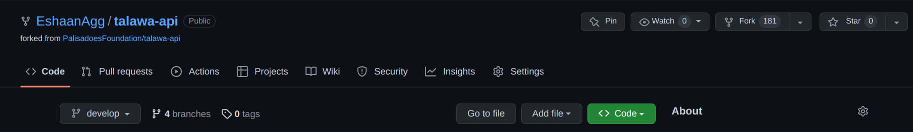
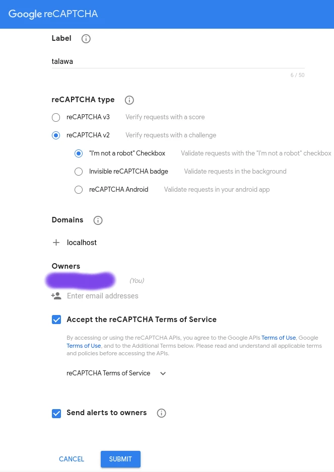
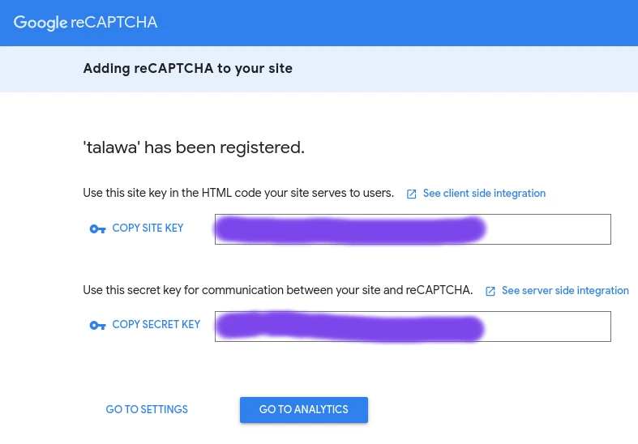
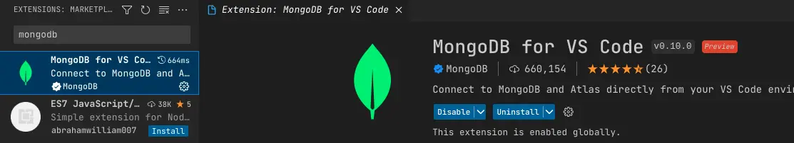
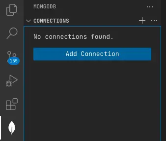
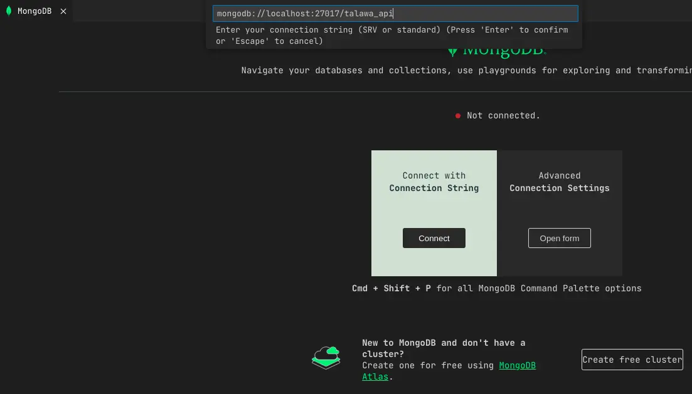
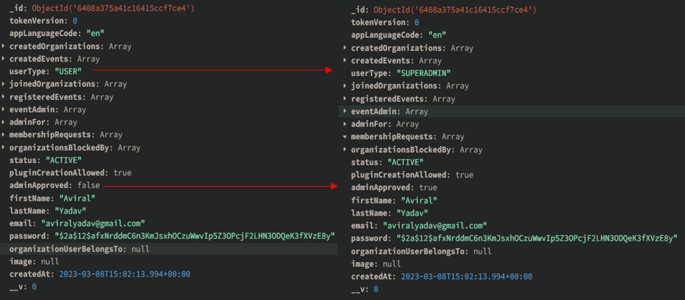

# Talawa-API Installation

This document provides instructions on how to set up and start a running instance of talawa-api on your local system. The instructions are written to be followed in sequence so make sure to go through each of them step by step without skipping any sections.

# Table of Contents

<!-- TOC -->

- [Talawa-API Installation](#talawa-api-installation)
- [Table of Contents](#table-of-contents)
- [Installation](#installation)
  - [Install node.js](#install-nodejs)
  - [Install git](#install-git)
  - [Setting up this repository](#setting-up-this-repository)
  - [Install the Required Packages](#install-the-required-packages)
  - [Install MongoDB](#install-mongodb)
    - [Setting up the mongoDB database](#setting-up-the-mongodb-database)
- [Configuration](#configuration)
  - [The .env Configuration File](#the-env-configuration-file)
  - [Generating Token Secrets](#generating-token-secrets)
    - [Setting up ACCESS\_TOKEN\_SECRET in .env file](#setting-up-access_token_secret-in-env-file)
      - [Linux](#linux)
      - [Windows](#windows)
    - [Setting up REFRESH\_TOKEN\_SECRET in .env file](#setting-up-refresh_token_secret-in-env-file)
  - [Configuring MongoDB](#configuring-mongodb)
    - [Setting up the MONGODB\_URL in .env file](#setting-up-the-mongodb_url-in-env-file)
    - [Using the CLI to get the MONGODB\_URL Connection String](#using-the-cli-to-get-the-mongodb_url-connection-string)
    - [Using Microsoft Windows to get the MONGODB\_URL Connection String](#using-microsoft-windows-to-get-the-mongodb_url-connection-string)
  - [Setting up .env LAST\_RESORT\_SUPERADMIN\_EMAIL parameter](#setting-up-env-last_resort_superadmin_email-parameter)
  - [Configuring Google ReCAPTCHA](#configuring-google-recaptcha)
    - [Setting up RECAPTCHA\_SECRET\_KEY in .env file](#setting-up-recaptcha_secret_key-in-env-file)
    - [Setting up .env MAIL\_USERNAME and MAIL\_PASSWORD ReCAPTCHA Parameters](#setting-up-env-mail_username-and-mail_password-recaptcha-parameters) 
    - [Setting up .env SMTP Variables](#setting-up-env-smtp-variables)
  - [Setting up Logger configurations (optional)](#setting-up-logger-configurations-optional)
    - [Setting up COLORIZE_LOGS in .env file](#setting-up-colorize_logs-in-env-file)
    - [Setting up LOG_LEVEL in .env file](#setting-up-log_level-in-env-file) 
  - [Configuring Google Firebase](#configuring-google-firebase)
    - [Generate Firebase Keys for the Talawa Notification Service](#generate-firebase-keys-for-the-talawa-notification-service)
    - [(Mobile Developers Only) Applying the Firebase Keys to the Talawa Mobile App](#mobile-developers-only-applying-the-firebase-keys-to-the-talawa-mobile-app)
- [Running Talawa-API](#running-talawa-api)
- [How to Access the Talawa-API URL](#how-to-access-the-talawa-api-url)
  - [For Talawa-API Developers](#for-talawa-api-developers)
  - [For Mobile App Developers](#for-mobile-app-developers)
    - [On Android Virtual Device](#on-android-virtual-device)
    - [On a Real Mobile Device](#on-a-real-mobile-device)
  - [For Talawa-Admin Developers](#for-talawa-admin-developers)
- [Accessing MongoDB](#accessing-mongodb)
  - [Managing MongoDB using the MongoDB Compass GUI](#managing-mongodb-using-the-mongodb-compass-gui)
  - [Managing MongoDB using the VSCode extension](#managing-mongodb-using-the-vscode-extension)
- [Manually Adding The First Super Admin User](#manually-adding-the-first-super-admin-user)
  - [Using MongoDB Compass](#using-mongodb-compass)
  - [Using Mongo Shell](#using-mongo-shell)
- [Other](#other)
  - [Changing default talawa-api port](#changing-default-talawa-api-port)
- [Testing](#testing)

<!-- /TOC -->
# Installation

You will need to have copies of your code on your local system. Here's how to do that.

## Install node.js

Best way to install and manage `node.js` is making use of node version managers. Two most popular node version managers right now are [fnm](https://github.com/Schniz/fnm) and [nvm](https://github.com/nvm-sh/nvm). We'd recommend `fnm` because it's written in `rust` and is much faster than `nvm`. Install whichever one you want and follow their guide to set up `node.js` on your system.

## Install git

Follow the setup guide for `git` on official [git docs](https://git-scm.com/downloads). Basic `git` knowledge is required for open source contribution so make sure you're comfortable with it. [Here's](https://youtu.be/apGV9Kg7ics) a good tutorial to get started with `git` and `github`.

## Setting up this repository

First you need a local copy of talawa-api. Run the following command in the directory of choice on your local system.

1. Navigate to the folder where you want to setup the repository. Here, I will set it up in a folder called `talawa`.
1. Navigate to the folder and open a terminal in this folder (you can right-click and choose appropiate option based onn your OS). Next, we'll fork and clone the `talawa-api` repository.
1. Navigate to [https://github.com/PalisadoesFoundation/talawa-api/](hhttps://github.com/PalisadoesFoundation/talawa-api/) and click on the `fork` button. It is placed on the right corner opposite the repository name `PalisadoesFoundation/talawa-api`.

1. You should now see `talawa-api` under your repositories. It will be marked as forked from `PalisadoesFoundation/talawa-api`

1. Clone the repository to your local computer (replacing the values in `{{}}`):
```
$ git clone https://github.com/{{YOUR GITHUB USERNAME}}/talawa-api.git
```

This will setup the repository and the code files locally for you. For more detailed instructions on contributing code, and managing the versions of this repository with Git, checkout [CONTRIBUTING.md here](./CONTRIBUTING.md)

`NOTE: All the commands we're going to execute in the following instructions will assume you are in the root directory of the project. If you fail to do so, the commands will not work.`

## Install the Required Packages

Install the packages required by `talawa-api` using this command:
```
npm install
```

## Install MongoDB

Talawa-api makes use of `MongoDB` for its database needs. We make use of `mongoose ODM` to interact with the MongoDB database from within the code.

### Setting up the mongoDB database

We're listing some common approaches to set up a running instance of MongoDB database:

1. `System native database approach:` (Highly Recommended) You can install MongoDB natively on your system and create/connect to the database. Follow the setup guide on official [MongoDB Docs](https://www.mongodb.com/docs/manual/administration/install-community/) for your respective operating system.
1. `Hosted database approach:` MongoDB Atlas is the easiest way to get a running instance of mongodb database. It is a hosted(remote) mongodb database provided by mongodb itself. If you're a beginner and don't want too much of a hassle setting up the database you should use this approach but you should eventually switch to local instance. Follow the setup guide on official [MongoDB Atlas Docs](https://www.mongodb.com/docs/atlas/getting-started/). Mongodb Atlas is just one of the many hosted database solutions. Some issues that you might face while using this are slower tests, slower API requests, dependence on Internet connection etc.
1. `Docker container approach:` If you are fluent in working with docker you should use this approach. Docker is a great way to manage and run applications without natively installing anything on your system. With this you can set up the mongodb database inside a docker container and manage it as per your will. Follow this [video tutorial](https://www.youtube.com/watch?v=uklyCSKQ1Po) to set up a mongodb docker container. You can learn about docker from [Docker docs](https://docs.docker.com/).

# Configuration
It's important to configure Talawa-Admin. Here's how to do it.
## The .env Configuration File

A file named `.env` is required in the root directory of talawa-api for storing environment variables used at runtime. It is not a part of the repo and you will have to create it. For a sample of `.env` file there is a file named `.env.sample` in the root directory. Create a new `.env` file by copying the contents of the `.env.sample` into `.env` file.
```
cp .env.sample .env
```

This `.env` file must be populated with the following environment variables for talawa-api to work:

| Variable                     | Description                                            |
| ---------------------------- | ------------------------------------------------------ |
| ACCESS_TOKEN_SECRET          | Used for signing/verifying JWT tokens                  |
| REFRESH_TOKEN_SECRET         | Used for signing/verifying JWT tokens                  |
| MONGO_DB_URL                 | Used for connecting talawa-api to the mongoDB database |
| RECAPTCHA_SECRET_KEY         | Used for authentication using reCAPTCHA                |
| MAIL_USERNAME                | Used for mailing service                               |
| MAIL_PASSWORD                | Used for mailing service                               |
| LAST_RESORT_SUPERADMIN_EMAIL | Used for promoting the default super admin             |
| COLORIZE_LOGS                | Used for colorized log formats in console              |
| LOG_LEVEL                    | Used for setting the logging level                     |

The following sections will show you how to configure each of these parameters.

## Generating Token Secrets

Access and refresh token secrets are used for authentication purposes.

### Setting up ACCESS_TOKEN_SECRET in .env file

Run the following command and copy/paste the result to the variable named `ACCESS_TOKEN_SECRET` in `.env` file.

#### Linux
The command to use is:
```
openssl rand -hex 32
```
#### Windows
 
This command is available if you have [Git for Windows](https://gitforwindows.org/) installed. Follow these steps:

1. Install `Git for Windows`
1. Run the Git Bash app
1. Issue the same command

```
openssl rand -hex 32
```

### Setting up REFRESH_TOKEN_SECRET in .env file

Run the following command and copy/paste the result to the variable named `REFRESH_TOKEN_SECRET` in `.env` file.

```
openssl rand -hex 32
```

## Configuring MongoDB
Here's how you will configure MongoDB.

**NOTE**: Talawa-API uses **2** databases, a primary and test version.
1. You only have to setup one database and provide it's URL in the `.env` file. This is the`primary database` and is used to store all your data.
1. We automatically create a new database with the name `TALAWA_API_TEST_DATABASE`. This is exclusively used for storing all the test data generated during the testing process so that it does not bloat the main database with unnecessary data.

### Setting up the MONGODB_URL in .env file
A `Connection String` is the URL that applications use to access a MongoDB database. Talawa-API will need to know the correct connection string to use to perform correctly. 

1. The `Connection String` is the `.env` variable named `MONGO_DB_URL` in the `.env` file.
1. The `Connection String` can differ depending on the approach you used to set up your database instance. Please read the official [mongodb docs](https://www.mongodb.com/docs/manual/reference/connection-string/) on `connection string`. 

### Using the CLI to get the MONGODB_URL Connection String
Your MongoDB installation may include either the `mongo` or `mongosh` command line utility. An easy way of determining the `connection string` is to:

1. Run the command line utility
1. Note the `connection string` in the first lines of the output.
1. Add the first section of the `connection string` to the `MONGO_DB_URL` section of the `.env` file. In this case it is `mongodb://127.0.0.1:27017/`

```
$ mongosh

Current Mongosh Log ID: e6ab4232a963d456920b3736
Connecting to:          mongodb://127.0.0.1:27017/?directConnection=true&serverSelectionTimeoutMS=2000&appName=mongosh+1.6.2
Using MongoDB:          6.0.4
Using Mongosh:          1.6.2

For mongosh info see: https://docs.mongodb.com/mongodb-shell/

...
...
...
...

```
### Using Microsoft Windows to get the MONGODB_URL Connection String
There are a few more steps that need to be done in a Windows environment.

1. Download the MongoDB Shell from the tools section at the following link:[Mongo Shell](https://www.mongodb.com/try/download/shell)
1. Extract the downloaded shell folder, locate the `mongosh` application, and paste it to the following location: `Program Files` -> `MongoDB` -> `bin`.
    1. You will find the mongosh application inside the `bin` folder]   
1. Add the path of the location where you pasted the `mongosh` application to your system's environment variables.
1. In a separate terminal, run the `mongod` command to start the local instance of the database.
1. Create a folder named "data" in the C drive and within it create a new folder named "db".
1. Open a terminal and run the `mongosh` command in the terminal you will get the connection string. In this case the Connection String is: `mongodb://127.0.0.1:27017/?directConnection=true&serverSelectionTimeoutMS=2000&appName=mongosh+1.6.2`
    1. In the `.env` file of Talawa-API, add the connection string to the `MONGO_DB_URL` section.
```
$ mongosh

Current Mongosh Log ID: e6ab4232a963d456920b3736
Connecting to:          mongodb://127.0.0.1:27017/?directConnection=true&serverSelectionTimeoutMS=2000&appName=mongosh+1.6.2
Using MongoDB:          6.0.4
Using Mongosh:          1.6.2

For mongosh info see: https://docs.mongodb.com/mongodb-shell/

...
...
...
...

```

## Setting up .env LAST_RESORT_SUPERADMIN_EMAIL parameter

The user with the email address set with this parameter will automatically be elevated to Super Admin status on registration. 

1. When installing, set this to the email address of the person you want to be the very first Super Admin. 
    - This will usually be the email address of the person installing the software.
1. If this is not set you will not be able to administer the application. 

If you don't set this parameter, then you'll need to follow the `Manually Adding The First Super Admin User` process discussed later in this document. 

Set this value in the event that you need to elevate any of your users to be a Super Admin.

**NOTE** It is STRONGLY advised that you remove the email address once the initial installation and setup has been done. 

## Configuring Google ReCAPTCHA

You need to have a `google` account to follow the following steps.

### Setting up RECAPTCHA_SECRET_KEY in .env file

We use `reCAPTCHA` for two factor authentication (2FA). Follow these steps:

1. Visit the [reCAPTCHA Key Generation](https://www.google.com/recaptcha/admin/create) URL.
1. Fill in the input blocks as shown in the screenshot:
   
1. Click on `Submit` button.
1. Copy the generated `Secret Key` to variable named `RECAPTCHA_SECRET_KEY` in `.env` file.

   
1. **NOTE**: Save the generated `Site key` as it will be used in `talawa-admin`.

### Setting up .env MAIL_USERNAME and MAIL_PASSWORD ReCAPTCHA Parameters

**NOTE:** ReCAPTCHA is a type of 2FA, so your Google account needs to have two factor authentication set up for the following steps to work. Make sure this is done before proceeding

The MAIL_USERNAME and MAIL_PASSWORD parameters are required to enable an app to access 2FA features. This is how to know what they should be.

1. Go to your [google account page](https://myaccount.google.com/).
1. Select `Security`.
1. Under `Signing in to Google` section select `App Passwords`.
1. Click on `Select app` section and choose `Other(Custom name)`, enter `talawa` as the custom name and press `Generate` button.
1.  Copy the 16 character generated app password to the variable named `MAIL_PASSWORD` in `.env` file.
1.  Copy your usual gmail address to the variable named `MAIL_USERNAME` in `.env` file.

For more info refer to this [Google Answer](https://support.google.com/accounts/answer/185833).

### Setting up .env SMTP Variables

For using SMTP server instead of Gmail, following steps need to be followed:

1. Set the ```IS_SMTP``` variable to ```true``` for example ```IS_SMTP=true```
1. Go to your your SMTP server, and note the following variables:
```
SMTP_HOST=your-smtp-server-hostname
SMTP_PORT=your-smtp-server-port
SMTP_USERNAME=your-smtp-username
SMTP_PASSWORD=your-smtp-password
SMTP_SSL_TLS=true-or-false
```
For example:
```
SMTP_HOST=smtp.hostgator.com
SMTP_PORT=465
SMTP_USERNAME=example@website.com
SMTP_PASSWORD=
SMTP_SSL_TLS=true
```

For more information on setting up a smtp server, here's a [useful article](https://sendgrid.com/blog/what-is-an-smtp-server/)

## Setting up Logger configurations *(optional)*

You can set up and customize logs by configuring the following parameters

### Setting up COLORIZE_LOGS in .env file
The parameter `COLORIZE_LOGS` is a boolean field and can be set to true or false. It customizes the log colorization formats displayed in console. You can set the value in `.env` file as 
```
COLORIZE_LOGS = false
```
If the parameter value is set to `true`, you should be able to see colorized logs in console, or else logs will display in the console's default simple format.


### Setting up LOG_LEVEL in .env file
There are different logging levels that can be configured by setting this parameter. The severity order of levels are displayed numerically ascending from most important to least important.<br>
```
 levels = {
    error: 0,
    warn: 1,
    info: 2,
    http: 3,
    verbose: 4,
    debug: 5,
    silly: 6
  }
```
<br>On setting this parameter value, log messages are displayed in the console only if the `message.level` is less than or equal to setted `LOG_LEVEL`
<br><br>
For our application, the most appropriate setting is `LOG_LEVEL = info` since most of information logged on the console are error messages, warnings or info texts.

## Configuring Google Firebase

You need to have a `google` account to follow the following steps.

<br/>

### Generate Firebase Keys for the Talawa Notification Service

We use firebase for mobile app notifications. To configure the notification service create a new firebase project and follow these steps:-

1. Create a new Firebase project for Talawa-API
1. When created you will automatically enter the project's console area
1. Click on the settings icon beside the `Project Overview` heading
1. Click on `Project Settings`
1. Click on the `Service Accounts` tab
1. Click on the `Node.js` radio button
1. Click on `Generate New Private Key` button
1. Confirm by clicking on `Generate Key`. This will automatically download the private keys in your browser.
1. Securely store the `JSON` file containing the private key. These will be used in the next section.

### (Mobile Developers Only) Applying the Firebase Keys to the Talawa Mobile App

The key generated in the previous step is in a format suitable for use in a mobile app. We need to convert it for use by the API. This will require you to do some work in the talawa repository to do the necessary conversion. The resulting output will be stored in a `lib/firebase_options.dart` file. Some of the contents of this file will then need to be added to the API's `.env` file. Here we go.

1.  Clone the talawa mobile app in a separate directory that is not under your Talawa-API directory.
1.  Enter that directory as you will need to edit files there
1.  Run the following commands to set the key in the environment variable for your respective operating system:

    1.  `Linux/macOS:`

            export GOOGLE_APPLICATION_CREDENTIALS="/PATH/TO/JSON/FILE/filename.json"

    1.  `Windows:`

            $env:GOOGLE_APPLICATION_CREDENTIALS="C:\PATH\TO\JSON\FILE\filename.json"

1.  Install the [Firebase CLI](https://firebase.google.com/docs/cli#install_the_firebase_cli).
1.  Save the original copy the `lib/firebase_options.dart` file as it will be modified.
1.  Run the following commands in the project directory of talawa mobile app:

        firebase login

        dart pub global activate flutterfire_cli

1.  Run any commands about exporting variables from the previous `dart` command.
1.  Run the following command to configure the application for Firebase
    `flutterfire configure`
1.  Select the project you created in the firebase console.
1.  Add `iOS` and `android` platforms to the project.
1.  Overwrite the `firebase_options.dart` file if asked so.
1.  The command will generate keys for the `iOS` and `android` platforms respectively and place them in the `firebase_options.dart` file.
1.  Edit the `firebase_options.dart` file.
1.  Add the parameters in the `static const FirebaseOptions android = FirebaseOptions` section of the `firebase_options.dart` file to the Talawa API `.env` file under the `androidFirebaseOptions` heading.
    1.  Replace any parameters that are already there in that section.
    1.  Remove any trailing commas on the lines you have added.
    1.  Remove any leading spaces on the lines you have added.
    1.  The final result in the `.env` file should look like this

                 apiKey: '9f6297b283db701dab7766c993c48b',
                 appId: '1:261699118608:android:366ff7dbdfba5c5a9e8392',
                 messagingSenderId: '261699118608',
                 projectId: 'talawa-thingy',
                 storageBucket: 'talawa-thingy.appspot.com',
1.  Add the parameters in the `static const FirebaseOptions ios = FirebaseOptions` section of the `firebase_options.dart` file to the Talawa API `.env` file under the `iosFirebaseOptions` heading. Replace any paramters that are already there.
    1.  Replace any parameters that are already there in that section.
    1.  Remove any trailing commas on the lines you have added.
    1.  Remove any leading spaces on the lines you have added.
    1.  The final result in the `.env` file should look like this

                 apiKey: 'c2d283aa45f4e858c9cbfe32c58c67',
                 appId: '1:261699118608:ios:1babbb3c07b8461ebdcb2',
                 messagingSenderId: '261699118608',
                 projectId: 'talawa-thingy',
                 storageBucket: 'talawa-thingy.appspot.com',
                 iosClientId: '261699118608-d519b739e43c6214374c0da62feaef.apps.googleusercontent.com',
                 iosBundleId: 'com.example.talawa',

1.  Undo the changes made to the `firebase_options.dart` file by overwriting it with the version you saved at the beginning of this section.

# Running Talawa-API

Talawa-api development server runs two processes simultaneously in the background. They are:

1. `GraphQL code generator:` This watches for changes in the graphQL type definition files and generates corresponding typescript types in the background. This results in good code editor experience with typescript.

2. `Talawa-api server:` This runs talawa-api directly transpiling the typescript files and running them without emitting as javascript files. It also watches for changes in the code files and restarts the server if it detects any changes.

Run the following command to start talawa-api development server:

        npm run dev

# How to Access the Talawa-API URL
There are many important URLs for accessing the API

## For Talawa-API Developers
By default talawa-api runs on `port 4000` on your system's localhost. It is available on the following endpoint:

        http://localhost:4000/

If you navigate to the endpoint you and see a `JSON` response like this it means talawa-api is running successfully:

        {"talawa-version":"v1","status":"healthy"}

GraphQL endpoint for handling `queries` and `mutations` is this:

        http://localhost:4000/graphql/

GraphQL endpoint for handling `subscriptions` is this:

        ws://localhost:4000/graphql/

## For Mobile App Developers

The Organization URL for Talawa mobile app developers will depend upon the device on which Mobile app is installed.

### On Android Virtual Device
- If Talawa Mobile App is installed on Android Virtual Device (AVD), use the following URL:
```
    http://10.0.2.2:4000/graphql
```

### On a Real Mobile Device
- If Talawa Mobile App is installed on a Real Mobile Device, follow the below steps to get URL:
    - Open Command Prompt in Windows, or Terminal in Linux/OSX
    - Enter ```ipconfig``` (For Windows Users) or ```ifconfig``` (For Linux/OSX Users)
    - Your Mobile and Computer (On which API server is running) must be on same Wifi Network. Use Mobile Hotspot to connect your computer to internet in case you don't have access to a Wifi Router.
    - Search for the ```Wireless LAN adapter Wi-Fi:``` and then copy ```IPv4 Address```, like in image below:
    - 
    - Now, use this IP address (```192.168.0.105``` in our case) to access the API instance using the following URL pattern:

```
    http://{IP_Address}:4000/graphql
```
For example:
```
    http://192.168.0.105:4000/graphql
```


## For Talawa-Admin Developers

The Organization URL for Talawa mobile app developers to use is:

       http://localhost:4000/graphql/


# Accessing MongoDB

There are many ways to access MongoDB. 

## Managing MongoDB using the MongoDB Compass GUI

Open MongoDB Compass and click on "Connect." You will now be able to access the graphical user interface of the local database.

**NOTE**: You can do the same in macOS and linux with minor tweaks. This has been provided to give a brief overview for beginners to setup their own local instance.

## Managing MongoDB using the VSCode extension

This guide is for `VSCode` users to easily manage their `MongoDB` databases:

1.  Install the offical `MongoDB` extension for `VSCode` named `MongoDB for VS Code`.

    

2. Connect your `MongoDB` database to the extension.

   

   

3. Now you can manage the database you are using for `talawa-api` through this extension within `VSCode`.

# Manually Adding The First Super Admin User

You can skip these instructions for now if you don't have running instance of Talawa-Admin.

1. This step is for mandatory Linux specific users others can skip to next step:

    1. You need to start `mongod` [Mongo daemon process] for `mongosh` to work use the following command for the same:
    - `sudo service mongod start` **[System V init(service)]** or `sudo systemctl start mongod` **[systemd(systemctl)]**
    2. To verify whether `mongod`[Mongo daemon process] is running you can use either:
    - `sudo systemctl status mongod` **[systemd(systemctl)]** or `sudo service mongod status` **[System V init(service)]**

## Using MongoDB Compass

1. Open MongoDB Compass and click on `Connect`.

2. Select `user` collections and edit the data. Change:
     1. `userType` from `USER` to `SUPERADMIN`
     2. `adminApproved` from `false` to `true`
     - 
     
## Using Mongo Shell
    
1. Open a terminal and run `mongosh` command to open interactive command line interface to work with MongoDB database.

2. In the `mongosh` terminal use the following command to edit the `users` collections data:
      1.Find the login credentials in the database through following command:
      ```
      db.users.find({userType: 'USER', firstName: '<user's first name>'})
      ```
      2.  Elevate permission from `USER` to `SUPERADMIN` and set `adminApproved` to `true`:
      ```
      db.users.updateOne({ firstName: '<user's first name>' },{ $set: { userType: 'SUPERADMIN', adminApproved: true }})
      ``` 
      3. To verify the details were updated correctly use:
      ```
      db.users.find({firstName:'<user's first name>' })
      ```
           
**Note**: You can do the edits via any of the two methods.

# Other
These are some other factors to consider

## Changing default talawa-api port

If port `4000` is not free on your system you can pass a custom environment variable named `PORT` to the script to make it use a different port on your system's localhost. Here's the syntax for it:

        PORT=<CUSTOM_PORT_VALUE> npm run dev

where `<CUSTOM_PORT_VALUE>` is whatever value you want the `PORT` to be. Whatever you pass will be substituted as the value for port and talawa-api development server on that port. Syntax wise it looks like-

        http://localhost:<CUSTOM_PORT_VALUE>/

For example:

        PORT=5000 npm run dev

will make talawa-api accessible on the following endpoint:

        http://localhost:5000/


# Testing

Talawa-api makes use of `vitest` to run tests because it is much faster than `jest` and more comfortable to work with.

You can run the tests for talawa-api using this command:

        npm run test
