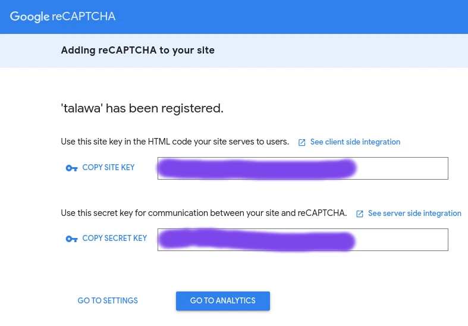

# Talawa-api installation

This document provides instructions on how to set up and start a running instance of talawa-api on your local system. The instructions are written to be followed in sequence so make sure to go thorough without skipping any sections. There are two main sections:- [Installation using standard way](#installation-using-standard-way) and [Installation using docker](#installation-using-docker). We recommend following `Installation using standard way` section because `Installation using docker` section requires good knowledge of working with docker.

 

# Table of contents

1. [Installation using standard way](#installation-using-standard-way)

   1. [Install node.js](#install-nodejs)
   2. [Install git](#install-git)
   3. [Clone this repository](#clone-this-repository)
   4. [Change directory into the cloned repo](#change-directory-into-the-cloned-repo)
   5. [Creating .env file](#creating-env-file)
   6. [Access/refresh token secrets](#accessrefresh-token-secrets)
   7. [MongoDB](#mongodb)
   8. [Google/firebase](#googlefirebase)
   9. [Running talawa-api](#running-talawa-api)
   10. [Accessing talawa-api](#accessing-talawa-api)
   11. [Running tests](#running-tests)

 

2. [Installation using docker](#installation-using-docker)

   1. [Automatic mongoDB docker container](#automatic-mongodb-docker-container)
   2. [Setting up .env file](#setting-up-env-file)
   3. [Building talawa-api docker image](#building-talawa-api-docker-image)
   4. [Running talawa-api docker container](#running-talawa-api-docker-container)
   5. [Accessing the automatic mongoDB docker container](#accessing-the-automatic-mongodb-docker-container)
   6. [Accessing talawa-api docker container](#accessing-talawa-api-docker-container)

 

# Installation using standard way

## Install node.js

Best way to install and manage `node.js` is making use of node version managers. Two most popular node version managers right now are [fnm](https://github.com/Schniz/fnm) and [nvm](https://github.com/nvm-sh/nvm). We'd recommend `fnm` because it's written in `rust` and is much faster than `nvm`. Install whichever one you want and follow their guide to set up `node.js` on your system.

 

## Install git

Follow the setup guide for `git` on official [git docs](https://git-scm.com/downloads). Basic `git` knowledge is required for open source contribution so make sure you're comfortable with it. [Here's](https://youtu.be/apGV9Kg7ics) a good tutorial to get started with `git` and `github`.

 

## Clone this repository

First you need a local copy of talawa-api. Run the following command in the directory of choice on your local system.

        git clone https://github.com/PalisadoesFoundation/talawa-api

This will download a local copy of talawa-api in that directory.

 

## Change directory into the cloned repo

Right after cloning the repo you can change the directory of your current `terminal(shell)` to the root directory of cloned repository using this command:-

        cd ./talawa-api

**NOTE:-** `All the commands we're going to execute in the following instructions will assume you are in the root directory of the project. If you fail to do so, the commands will not work.`

 

## Creating .env file

A file named `.env` is required in the root directory of talawa-api for storing environment variables used at runtime. It is not a part of the repo and you will have to create it. For a sample of `.env` file there is a file named `.env.sample` in the root directory. Create a new `.env` file by copying the contents of the `.env.sample` into `.env` file.

        cp .env.sample .env

This `.env` file must be populated with the following environment variables for talawa-api to work:-

| Variable             | Description                                            |
| -------------------- | ------------------------------------------------------ |
| ACCESS_TOKEN_SECRET  | Used for signing/verifying JWT tokens                  |
| REFRESH_TOKEN_SECRET | Used for signing/verifying JWT tokens                  |
| MONGO_DB_URL         | Used for connecting talawa-api to the mongoDB database |
| RECAPTCHA_SECRET_KEY | Used for authentication using reCAPTCHA                |
| MAIL_USERNAME        | Used for mailing service                               |
| MAIL_PASSWORD        | Used for mailing service                               |

Follow the instructions from [Access/refresh token secrets](#accessrefresh-token-secrets) section up to and including [Google/firebase](#googlefirebase) section to learn more about these environment variables and how to set them up.

 

## Access/refresh token secrets

Access and refresh token secrets are used for authentication purposes.

 

### Setting up ACCESS_TOKEN_SECRET in .env file

Run the following command and copy/paste the result to the variable named `ACCESS_TOKEN_SECRET` in `.env` file.

        openssl rand -hex 32

 

### Setting up REFRESH_TOKEN_SECRET in .env file

Run the following command and copy/paste the result to the variable named `REFRESH_TOKEN_SECRET` in `.env` file.

        openssl rand -hex 32

 

## MongoDB

Talawa-api makes use of `mongoDB` for its database needs. We make use of `mongoose ODM` to interact with the mongoDB database from within the code.

 

### Setting up the mongoDB database

We're listing some common approaches to set up a running instance of mongodb database:-

1. `Hosted database approach:-` MongoDB Atlas is the easiest way to get a running instance of mongodb database. It is a hosted(remote) mongodb database provided by mongodb itself. If you're a beginner and don't want too much of a hassle setting up the database you should use this approach. Follow the setup guide on official [mongodb atlas docs](https://www.mongodb.com/docs/atlas/getting-started/). Mongodb Atlas is just one of the many hosted database solutions. If you want to use something else please do your own research.

2. `System native database approach:-` You can install mongodb natively on your system and create/connect to the database. Follow the setup guide on official [mongodb docs](https://www.mongodb.com/docs/manual/administration/install-community/) for your respective operating system.

3. `Docker container approach:-` If you are fluent in working with docker you should use this approach. Docker is a great way to manage and run applications without natively installing anything on your system. With this you can set up a mongodb database inside a docker container and manage it as per your will. Follow this [video tutorial](https://www.youtube.com/watch?v=uklyCSKQ1Po) to set up a mongodb docker container.

 

### Setting up MONGODB_URL in .env file

Which approach you choose to set up your mongodb database does not matter. What matters is the `connection string` to that database using which talawa-api can connect to it. `Connection string` can differ depending on the approach you used to set up your database instance. Please read the official [mongodb docs](https://www.mongodb.com/docs/manual/reference/connection-string/) on `connection string`. Copy/paste this `connection string` to the variable named `MONGO_DB_URL` in `.env` file.

 

## Google/firebase

You need to have a `google` account to follow the following steps.

 

### Setting up RECAPTCHA_SECRET_KEY in .env file

 

We use `reCAPTCHA` for authentication. Follow these steps:-

1. Visit [this](https://www.google.com/recaptcha/admin/create) url.
2. Fill in the input blocks as shown in the screenshot:-

   

3. Click on `Submit` button.
4. Copy the generated secret key to variable named `RECAPTCHA_SECRET_KEY` in `.env` file.

   

 

### Setting up MAIL_USERNAME/MAIL_PASSWORD in .env file

**NOTE:-** `Your google account needs to have two factor authentication set up for the following steps to work.`

1.  Go to your [google account page](https://myaccount.google.com/).

2.  Select `Security`.

3.  Under `Signing in to Google` section select `App Passwords`.

4.  Click on `Select app` section and choose `Other(Custom name)`, enter `talawa` as the custom name and press `Generate` button.

5.  Copy the 16 character generated app password to the variable named `MAIL_PASSWORD` in `.env` file.

6.  Copy you usual gmail address to the variable named `MAIL_USERNAME` in `.env` file.

For more info refer to [this](https://support.google.com/accounts/answer/185833).

 

### Firebase notification service

We use firebase for mobile app notifications. To configure the notification service create a new firebase project and follow these steps:-

1.  In the Firebase console, open Settings > [Service Accounts](https://console.firebase.google.com/project/_/settings/serviceaccounts/adminsdk).

2.  Click on `Generate New Private Key`, then confirm by clicking on `Generate Key`.

3.  Securely store the `JSON` file containing the key.

4.  Run the following commands to set the key in the environment variable for your respective operating system:

    1.  `Linux/macOS:`

            export GOOGLE_APPLICATION_CREDENTIALS="/home/user/Downloads/service-account-file.json"

    2.  `Windows:`

            $env:GOOGLE_APPLICATION_CREDENTIALS="C:\Users\username\Downloads\service-account-file.json"

5.  Install the [Firebase CLI](https://firebase.google.com/docs/cli#install_the_firebase_cli).

6.  Copy the `firebase_options.dart` file as it will be modified.

7.  Run the following commands in the project directory of talawa mobile app:

        firebase login

        dart pub global activate flutterfire_cli

        flutterfire configure

8.  Select the project you created in the firebase console.

9.  Add `iOS` and `android` platforms to the project.

10. Overwrite the `firebase_options.dart` file if asked so.

11. Copy the keys to `.env` file. For more information on how to set the keys refer to `.env.sample` file.

12. Undo the changes made to the `firebase_options.dart` file by pasting the old content from `step 6`.

 

## Installing required packages/dependencies

Run the following command to install the packages and dependencies required by talawa-api:-

        npm run install

 

## Running talawa-api

Talawa-api development server runs two processes simultaneously in the background. They are:-

1. `GraphQL code generator:-` This watches for changes in the graphQL type definition files and generates corresponding typescript types in the background. This results in good code editor experience with typescript.

2. `Talawa-api server:-` This runs talawa-api directly transpiling the typescript files and running them without emitting as javascript files. It also watches for changes in the code files and restarts the server if it detects any changes.

Run the following command to start talawa-api development server:-

        npm run dev

 

## Accessing talawa-api

By default talawa-api runs on `port 4000` on your system's localhost. It is available on the following endpoint:-

        http://localhost:4000/

If you navigate to the endpoint you and see a `JSON` response like this it means talawa-api is running successfully:-

        {"talawa-version":"v1","status":"healthy"}

GraphQL endpoint for handling `queries` and `mutations` is this:-

        http://localhost:4000/graphql/

GraphQL endpoint for handling `subscriptions` is this:-

        ws://localhost:4000/graphql/

 

## Changing the port on which talawa-api runs

If port `4000` is not free on your system you can pass a custom environment variable named `PORT` to the script to make it use a different port on your system's localhost. Here's the syntax for it:-

        PORT=<CUSTOM_PORT_VALUE> npm run dev

where `<CUSTOM_PORT_VALUE>` is whatever value you want the `PORT` to be. Whatever you pass will be substituted as the value for port and talawa-api development server on that port. Syntax wise it looks like-

        http://localhost:<CUSTOM_PORT_VALUE>/

For example:-

        PORT=5000 npm run dev

will make talawa-api accessible on the following endpoint:-

        http://localhost:5000/

 

## Running tests

Talawa-api makes use of `vitest` to run tests because it is much faster than `jest` and more comfortable to work with.

You can run the tests for talawa-api using this command:-

        npm run test

 

# Installation using docker

We've written `docker` and `docker compose` configuration files if you want to run talawa-api inside a docker container.

**NOTE:-** `We are not listing every possible thing you need to know about docker in the following steps. We expect you to have minimum working knowledge with docker if you're using this approach. If you don't know anything about docker it's better to either learn about docker first or just follow the steps mentioned before this section. Also, make sure that you have plenty of free storage on your system as docker downloads a lot of large images.`

 

## Setting up .env file

We have written the `docker` configuration in such a way that a mongodb `docker` container is also started along with talawa-api `docker` container. This is done so you don't have to manually set up a mongodb database and then connect it to the talawa-api `docker` container yourselves.

To make use of the mongodb `docker` container that's automatically started with talawa-api `docker` container copy/paste the following connection string to the variable named `MONGODB_URL` in `.env` file:-

        mongodb://talawa_mongodb:27017/<DATABASE_NAME>?retryWrites=true&w=majority

where `<DATABASE_NAME>` is name of the database you want to use or are using for talawa-api.

To set up the remaining environment variables follow the steps from [Creating .env file](#creating-env-file) section up to and including [Google/firebase](#googlefirebase) section excluding the [MongoDB](#mongodb) section.

 

## Building talawa-api docker image

Run the following command to build the `docker` image for talawa-api:-

        sudo docker-compose build

 

## Running talawa-api docker container

**NOTE:-** `We have mapped talawa-api docker container to port 4000 of your system's localhost. Make sure that port 4000 is free on your system's localhost or you'll get an error.`

To start the talawa-api `docker` container run this command while being in the root directory of cloned talawa-api folder:-

        sudo docker-compose up

This will also start up `mongodb` docker container alongside talawa-api `docker` container.

 

## Accessing the automatic mongoDB docker container

We have mapped the `mongodb container` to port `27017` of your system's localhost if you want to access it. Make sure that port `27017` is free on your system's localhost or you'll get an error. To access this `mongodb` container on your system use this connection string:-

        mongodb://localhost:27017/<DATABASE_NAME>?retryWrites=true&w=majority

where `<DATABASE_NAME>` is name of the database you want to use or are using for talawa-api.

 

## Accessing talawa-api docker container

You can access the running talawa-api `docker` container on your system using this endpoint:-

        http://localhost:4000/

Refer to [Accessing talawa-api](#accessing-talawa-api) section for more information.
