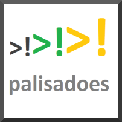

# Talawa API Documentation Website

[](https://github.com/PalisadoesFoundation/talawa-api)

## Installation

This document provides instructions on how to set up and start a running instance of the [talawa-api documentation website](https://docs-admin.talawa.io/) on your local system. The instructions are written to be followed in sequence so make sure to go through each of them step by step without skipping any sections.

## Table of Contents

<!-- TOC -->

- [Talawa API Documentation Website](#talawa-api-documentation-website)
  - [Installation](#installation)
  - [Table of Contents](#table-of-contents)
  - [Prerequisites for Developers](#prerequisites-for-developers)
    - [Install the Required NPM Package Manager](#install-the-required-npm-package-manager)
    - [Install the Required Packages](#install-the-required-packages)
  - [Running the Development Server](#running-the-development-server)
  - [Building Static HTML Pages](#building-static-html-pages)

<!-- /TOC -->

## Prerequisites for Developers

The contents of the `talawa-api` repo is used to automatically create [the talawa-api Documentation website](https://docs-admin.talawa.io/). The automation uses [Docusaurus](https://docusaurus.io/docs/), a modern static website generator.

We recommend that you follow these steps before beginning development work in this repository.

### Install the Required NPM Package Manager

For the package installation use `npm`. The steps are simple:

1. Validate the `npm` installation on your local device by running the following command. You should get the `npm` version.

```terminal
$ npm -version
```

1. If you get an error, then you'll need to install `npm`. A simple way to do this use [fnm](https://github.com/Schniz/fnm).

### Install the Required Packages

From the `talawa-api/docs` directory, run the following command.

```console
$ npm install
```

## Running the Development Server

To preview your changes as you edit the files, you can run a local development server that will serve your website and it will reflect the latest changes.

The command to run the server is:

```console
$ npm run start
OR
$ npm start
```

By default, a browser window will open at http://localhost:3000.

This command starts a local development server and open up a browser window. Most changes are reflected live without having to restart the server.

## Building Static HTML Pages

**In most cases is unnecessary**. Running the `development server` will be sufficient.

If you need to generate static HTML pages (unlikely), then follow these steps.

```console
$ npm run build
```

This command generates static content into the `/build` directory and can be served using any static contents hosting service.
