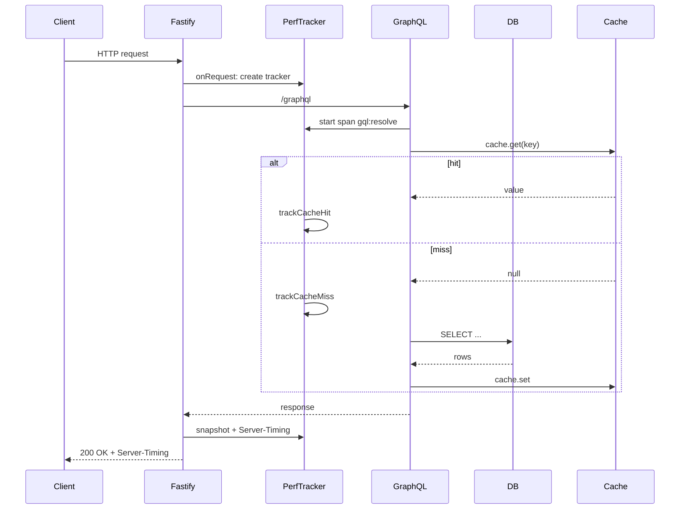

# Performance Monitoring and Observability

Talawa API includes built-in performance monitoring to help DevOps teams track request-level performance metrics.

## Overview

The Performance Metrics Foundation provides:
- **Server-Timing headers** on all HTTP responses for browser-based performance analysis
- **`/metrics/perf` endpoint** returning recent performance snapshots for monitoring dashboards
- **Request-scoped tracking** of database operations, cache hits/misses, and total request duration
- **Slow query detection** with automatic logging for operations exceeding thresholds
- **GraphQL complexity tracking** to identify expensive queries
- **Background worker aggregation** for periodic performance summaries

## End-to-End Request Flow

The following sequence diagram illustrates how performance tracking works throughout a request lifecycle:



## Server-Timing Headers

Every API response includes a `Server-Timing` header with performance breakdown:

```
Server-Timing: db;dur=45, cache;desc="hit:12|miss:3", total;dur=127
```

### Header Components

| Metric | Description | Example |
|--------|-------------|---------|
| `db;dur=X` | Total database operation time (ms) | `db;dur=45` |
| `cache;desc="hit:X\|miss:Y"` | Cache hit and miss counts | `cache;desc="hit:12\|miss:3"` |
| `total;dur=X` | Total request duration (ms) | `total;dur=127` |

### Viewing in Browser DevTools

1. Open your browser's **Developer Tools** (F12)
2. Go to the **Network** tab
3. Click on any API request
4. View the **Timing** tab to see the Server-Timing breakdown


Modern browsers (Chrome, Firefox, Edge) automatically visualize these metrics.

## `/metrics/perf` Endpoint

### Accessing Metrics

```bash
GET http://localhost:4000/metrics/perf
```

**Response:**
```json
{
  "recent": [
    {
      "totalMs": 127,
      "totalOps": 8,
      "cacheHits": 12,
      "cacheMisses": 3,
      "hitRate": 0.8,
      "ops": {
        "db:users.byId": { "count": 2, "ms": 45.2, "max": 18.3 },
        "gql:complexity": { "count": 1, "ms": 0.5, "max": 0.5 }
      },
      "slow": [
        { "op": "db:users.byId", "ms": 250 }
      ]
    }
  ]
}
```

### Response Schema

| Field | Type | Description |
|-------|------|-------------|
| `recent` | Array | Last 50 performance snapshots (limited for memory) |
| `totalMs` | number | Total time spent in tracked operations (rounded) |
| `totalOps` | number | Total number of operations tracked |
| `cacheHits` | number | Number of cache hits during request |
| `cacheMisses` | number | Number of cache misses during request |
| `hitRate` | number | Cache hit rate (hits / (hits + misses), 0-1) |
| `ops` | Object | Operation-level statistics |
| `ops[name].count` | number | Number of times operation was called |
| `ops[name].ms` | number | Total milliseconds spent in operation |
| `ops[name].max` | number | Maximum duration for single operation call |
| `slow` | Array | Slow operations exceeding threshold (max 50) |
| `slow[].op` | string | Operation name that was slow |
| `slow[].ms` | number | Duration of the slow operation (rounded) |

### Retention

- **In-Memory Storage**: Last 200 snapshots are kept in memory
- **Endpoint Returns**: Maximum 50 most recent snapshots
- **No Persistence**: Metrics reset on server restart

## Integration Examples

### Monitoring Dashboard

Poll the `/metrics/perf` endpoint to display real-time performance:

```javascript
// Fetch performance metrics every 5 seconds
setInterval(async () => {
  const response = await fetch('http://localhost:4000/metrics/perf');
  const data = await response.json();
  
  // Display average database time
  const avgDbTime = data.recent
    .map(s => s.ops.db?.ms || 0)
    .reduce((a, b) => a + b, 0) / data.recent.length;
  
  console.log(`Avg DB time: ${avgDbTime.toFixed(2)}ms`);
}, 5000);
```

### APM Tool Integration

Many Application Performance Monitoring (APM) tools automatically capture `Server-Timing` headers:

- **New Relic**: Automatically captures custom timing metrics
- **Datadog**: RUM integration reads Server-Timing headers
- **Elastic APM**: Correlates server-side timing with user experience

### Custom Alerting

Monitor for slow requests using the `/metrics/perf` endpoint:

```python
import requests
import time

THRESHOLD_MS = 500  # Alert on requests > 500ms

while True:
    response = requests.get('http://localhost:4000/metrics/perf')
    data = response.json()
    
    slow_requests = [s for s in data['recent'] if s['totalMs'] > THRESHOLD_MS]
    
    if slow_requests:
        print(f"⚠️  {len(slow_requests)} slow requests detected!")
        for req in slow_requests:
            print(f"  - Total: {req['totalMs']}ms, DB: {req['ops'].get('db', {}).get('ms', 0)}ms")
    
    time.sleep(10)
```

## Production Considerations

### Security

> **⚠️ WARNING**: The `/metrics/perf` endpoint currently has no authentication. For production deployments:
> - Add API key authentication, or
> - Restrict access to admin users only, or  
> - Use network-level controls (VPN, internal-only access)

### Performance Impact

The performance tracking system is designed to be lightweight:
- **Memory overhead**: ~200 snapshots × ~500 bytes = ~100KB
- **CPU overhead**: Negligible (simple timestamp math)
- **No I/O**: All metrics stored in-memory, no database writes

### Privacy

Performance metrics **do not contain PII** (Personally Identifiable Information):
- ✅ Operation counts and timings
- ✅ Cache statistics
- ❌ User IDs, emails, or other personal data
- ❌ Request/response payloads

## Slow Query Detection

The performance tracker automatically identifies and logs slow operations:

- **Operation Threshold**: Operations exceeding 200ms are marked as slow
- **Request Threshold**: Total request time exceeding 500ms triggers a warning log
- **GraphQL Complexity**: Queries with complexity score >= 100 are logged as warnings

### Slow Query Logs

Slow requests are automatically logged with details:

```json
{
  "msg": "Slow request",
  "totalMs": 750,
  "path": "/graphql",
  "dbMs": 450,
  "hitRate": 0.6,
  "slowOps": [
    { "op": "db:users.byId", "ms": 250 },
    { "op": "db:organizations.byId", "ms": 200 }
  ]
}
```

## GraphQL Complexity Tracking

GraphQL query complexity is automatically calculated and tracked:

- **Complexity Calculation**: Uses `@pothos/plugin-complexity` to analyze query structure
- **Mutation Penalty**: Mutations have a base cost added to their complexity score
- **High Complexity Warning**: Queries with complexity >= 100 are logged as warnings
- **Tracking**: Complexity calculation time is tracked as `gql:complexity` operation

### Example Complexity Log

```json
{
  "msg": "High complexity GraphQL query",
  "complexity": 150,
  "operationType": "query"
}
```

## Background Worker Aggregation

A background worker runs every 5 minutes (configurable via `PERF_AGGREGATION_CRON_SCHEDULE`) to aggregate and log performance metrics:

### Aggregated Metrics

The worker logs a summary including:
- Average request duration
- Average database operation time
- Total cache hits/misses and hit rate
- Count of slow requests
- Count of high complexity queries
- Top 5 slowest operations

### Example Aggregation Log

```json
{
  "msg": "Performance metrics aggregation",
  "periodStart": "2024-01-01T12:00:00.000Z",
  "periodEnd": "2024-01-01T12:05:00.000Z",
  "totalRequests": 1250,
  "avgRequestMs": 85,
  "avgDbMs": 45,
  "totalCacheHits": 8500,
  "totalCacheMisses": 1200,
  "avgHitRate": 0.88,
  "slowRequestCount": 12,
  "highComplexityCount": 3,
  "topSlowOps": [
    { "op": "db:users.byId", "avgMs": 180, "count": 45 },
    { "op": "db:organizations.byId", "avgMs": 150, "count": 30 }
  ]
}
```

## Automatic Instrumentation

The performance monitoring system automatically instruments:

### DataLoaders

All DataLoaders are automatically wrapped with performance tracking:
- `users.byId` → tracked as `db:users.byId`
- `organizations.byId` → tracked as `db:organizations.byId`
- `events.byId` → tracked as `db:events.byId`
- `actionItems.byId` → tracked as `db:actionItems.byId`

### Cache Operations

All cache operations are automatically tracked:
- `get()` operations track hits/misses
- `mget()` operations track hits/misses per key
- Cache hit rate is calculated automatically

## Extending Performance Tracking

### Custom Operations

Track custom operations in your code:

```typescript
// In a GraphQL resolver
export const myResolver = async (parent, args, ctx) => {
  // Track external API call
  const result = await ctx.perf?.time('external-api', async () => {
    return await fetch('https://api.example.com/data');
  });
  
  return result;
};
```

### Manual Timing

For non-async operations:

```typescript
const stopTimer = ctx.perf?.start('computation');
// ... expensive computation ...
stopTimer?.();
```

## Troubleshooting

### Metrics Not Appearing

1. **Check plugin registration**: Ensure `performance.ts` plugin is loaded in `src/fastifyPlugins/index.ts`
2. **Verify headers**: Use `curl -v` to inspect response headers
3. **Browser compatibility**: Ensure browser supports Server-Timing (Chrome 65+, Firefox 61+)

### Endpoint Returns Empty Array

- Normal on server restart (metrics are in-memory)
- Make some API requests to populate snapshots

### High `totalMs` Values

If `totalMs` is unexpectedly high:
1. Check `ops.db.ms` for slow database queries
2. Review `cacheMiss` count (high misses = more DB hits)
3. Inspect individual operation max times for bottlenecks

## Configuration

### Environment Variables

- `PERF_AGGREGATION_CRON_SCHEDULE`: Cron schedule for performance aggregation worker (default: `*/5 * * * *` - every 5 minutes)

### Slow Query Thresholds

Thresholds are configurable when creating a performance tracker:

```typescript
// Custom slow operation threshold (default: 200ms)
const tracker = createPerformanceTracker({ slowMs: 300 });
```

## Further Reading

- [MDN: Server-Timing](https://developer.mozilla.org/en-US/docs/Web/HTTP/Headers/Server-Timing)
- [W3C Server Timing Specification](https://w3c.github.io/server-timing/)
- Implementation: `src/fastifyPlugins/performance.ts`
- Tracker utility: `src/utilities/metrics/performanceTracker.ts`
- DataLoader instrumentation: `src/utilities/metrics/withMetrics.ts`
- Cache instrumentation: `src/services/caching/metricsCacheProxy.ts`
- Aggregation worker: `src/workers/performanceAggregationWorker.ts`
