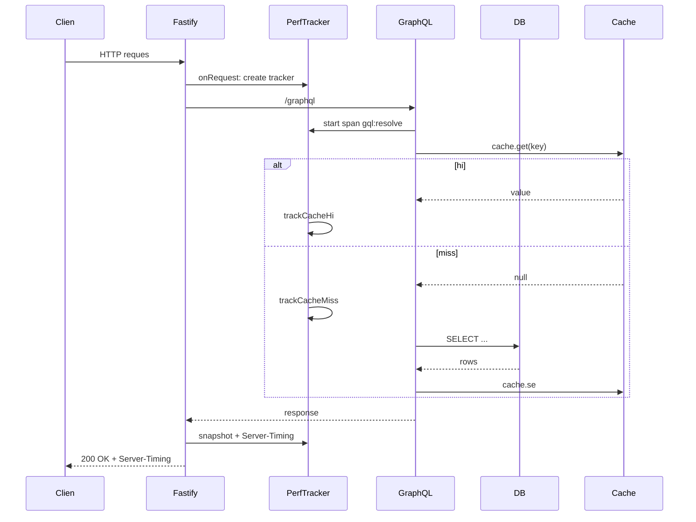

# Performance Monitoring and Observability

Talawa API includes built-in performance monitoring to help DevOps teams track request-level performance metrics.

## Overview

The Performance Metrics Foundation provides:
- **Server-Timing headers** on all HTTP responses for browser-based performance analysis
- **`/metrics/perf` endpoint** returning recent performance snapshots for monitoring dashboards
- **Request-scoped tracking** of database operations, cache hits/misses, and total request duration
- **Slow query detection** with automatic logging for operations exceeding thresholds
- **GraphQL complexity tracking** to identify expensive queries
- **Background worker aggregation** for periodic performance summaries

## End-to-End Request Flow

The following sequence diagram illustrates how performance tracking works throughout a request lifecycle:



## Server-Timing Headers

Every API response includes a `Server-Timing` header with performance breakdown:

```
Server-Timing: db;dur=45, cache;desc="hit:12|miss:3", total;dur=127
```

### Header Components

| Metric | Description | Example |
|--------|-------------|---------|
| `db;dur=X` | Total database operation time (ms) | `db;dur=45` |
| `cache;desc="hit:X\|miss:Y"` | Cache hit and miss counts | `cache;desc="hit:12\|miss:3"` |
| `total;dur=X` | Total request duration (ms) | `total;dur=127` |

### Viewing in Browser DevTools

1. Open your browser's **Developer Tools** (F12)
2. Go to the **Network** tab
3. Click on any API reques
4. View the **Timing** tab to see the Server-Timing breakdown


Modern browsers (Chrome, Firefox, Edge) automatically visualize these metrics.

## `/metrics/perf` Endpoin

### Accessing Metrics

The `/metrics/perf` endpoint is protected by authentication. You must provide either:
- An API key in the `Authorization` header, or
- Access from an allowed IP address

**Using API Key:**
```bash
GET http://localhost:4000/metrics/perf
Authorization: Bearer <your-api-key>
```

**Or without Bearer prefix:**
```bash
GET http://localhost:4000/metrics/perf
Authorization: <your-api-key>
```

**Response:**
```json
{
  "recent": [
    {
      "totalMs": 127,
      "totalOps": 8,
      "cacheHits": 12,
      "cacheMisses": 3,
      "hitRate": 0.8,
      "ops": {
        "db:users.byId": { "count": 2, "ms": 45.2, "max": 18.3 },
        "gql:complexity": { "count": 1, "ms": 0.5, "max": 0.5 }
      },
      "slow": [
        { "op": "db:users.byId", "ms": 250 }
      ]
    }
  ]
}
```

### Response Schema

| Field | Type | Description |
|-------|------|-------------|
| `recent` | Array | Last 50 performance snapshots (limited for memory) |
| `totalMs` | number | Total time spent in tracked operations (rounded) |
| `totalOps` | number | Total number of operations tracked |
| `cacheHits` | number | Number of cache hits during request |
| `cacheMisses` | number | Number of cache misses during request |
| `hitRate` | number | Cache hit rate (hits / (hits + misses), 0-1) |
| `ops` | Object | Operation-level statistics |
| `ops[name].count` | number | Number of times operation was called |
| `ops[name].ms` | number | Total milliseconds spent in operation |
| `ops[name].max` | number | Maximum duration for single operation call |
| `slow` | Array | Slow operations exceeding threshold (max 50) |
| `slow[].op` | string | Operation name that was slow |
| `slow[].ms` | number | Duration of the slow operation (rounded) |

### Retention

- **In-Memory Storage**: Last 200 snapshots are kept in memory
- **Endpoint Returns**: Maximum 50 most recent snapshots
- **No Persistence**: Metrics reset on server restar

## Integration Examples

### Monitoring Dashboard

Poll the `/metrics/perf` endpoint to display real-time performance:

```javascrip
// Fetch performance metrics every 5 seconds
setInterval(async () => {
  const response = await fetch('http://localhost:4000/metrics/perf');
  const data = await response.json();

  // Display average database time
  const avgDbTime = data.recen
    .map(s => s.ops.db?.ms || 0)
    .reduce((a, b) => a + b, 0) / data.recent.length;

  console.log(`Avg DB time: ${avgDbTime.toFixed(2)}ms`);
}, 5000);
```

### APM Tool Integration

Many Application Performance Monitoring (APM) tools automatically capture `Server-Timing` headers:

- **New Relic**: Automatically captures custom timing metrics
- **Datadog**: RUM integration reads Server-Timing headers
- **Elastic APM**: Correlates server-side timing with user experience

### Custom Alerting

Monitor for slow requests using the `/metrics/perf` endpoint:

```python
import requests
import time

THRESHOLD_MS = 500  # Alert on requests > 500ms

while True:
    response = requests.get('http://localhost:4000/metrics/perf')
    data = response.json()

    slow_requests = [s for s in data['recent'] if s['totalMs'] > THRESHOLD_MS]

    if slow_requests:
        print(f"⚠️  {len(slow_requests)} slow requests detected!")
        for req in slow_requests:
            print(f"  - Total: {req['totalMs']}ms, DB: {req['ops'].get('db', {}).get('ms', 0)}ms")

    time.sleep(10)
```

## Production Considerations

### Security

The `/metrics/perf` endpoint is protected by authentication. Configure one or both of the following:

**Option 1: API Key Authentication**
```bash
METRICS_API_KEY=your-secret-api-key-here
```

Requests must include the API key in the `Authorization` header:
```bash
Authorization: Bearer <your-api-key>
# or
Authorization: <your-api-key>
```

**Option 2: IP-Based Access Control**
```bash
METRICS_ALLOWED_IPS=127.0.0.1,10.0.0.0/8,192.168.1.0/24
```

**IP Address Format:**
- Exact IP: `127.0.0.1`
- CIDR range: `192.168.1.0/24` (allows 192.168.1.0-192.168.1.255)
- Multiple entries: comma-separated lis

> **⚠️ WARNING**: If neither `METRICS_API_KEY` nor `METRICS_ALLOWED_IPS` is configured, the endpoint will be unprotected (not recommended for production).

### Performance Impac

The performance tracking system is designed to be lightweight:
- **Memory overhead**: ~200 snapshots × ~500 bytes = ~100KB
- **CPU overhead**: Negligible (simple timestamp math)
- **No I/O**: All metrics stored in-memory, no database writes

### Privacy

Performance metrics **do not contain PII** (Personally Identifiable Information):
- ✅ Operation counts and timings
- ✅ Cache statistics
- ❌ User IDs, emails, or other personal data
- ❌ Request/response payloads

## Slow Query Detection

The performance tracker automatically identifies and logs slow operations:

- **Operation Threshold**: Operations exceeding 200ms are marked as slow
- **Request Threshold**: Total request time exceeding 500ms triggers a warning log
- **GraphQL Complexity**: Queries with complexity score >= 100 are logged as warnings

### Slow Query Logs

Slow requests are automatically logged with details:

```json
{
  "msg": "Slow request",
  "totalMs": 750,
  "path": "/graphql",
  "dbMs": 450,
  "hitRate": 0.6,
  "slowOps": [
    { "op": "db:users.byId", "ms": 250 },
    { "op": "db:organizations.byId", "ms": 200 }
  ]
}
```

## GraphQL Complexity Tracking

GraphQL query complexity is automatically calculated and tracked:

- **Complexity Calculation**: Uses `@pothos/plugin-complexity` to analyze query structure
- **Mutation Penalty**: Mutations have a base cost added to their complexity score
- **High Complexity Warning**: Queries with complexity >= 100 are logged as warnings
- **Tracking**: Complexity calculation time is tracked as `gql:complexity` operation

### Example Complexity Log

```json
{
  "msg": "High complexity GraphQL query",
  "complexity": 150,
  "operationType": "query"
}
```

## Background Worker Aggregation

A background worker runs every 5 minutes (configurable via `PERF_AGGREGATION_CRON_SCHEDULE`) to aggregate and log performance metrics:

### Aggregated Metrics

The worker logs a summary including:
- Average request duration
- Average database operation time
- Total cache hits/misses and hit rate
- Count of slow requests
- Count of high complexity queries
- Top 5 slowest operations

### Example Aggregation Log

```json
{
  "msg": "Performance metrics aggregation",
  "periodStart": "2024-01-01T12:00:00.000Z",
  "periodEnd": "2024-01-01T12:05:00.000Z",
  "totalRequests": 1250,
  "avgRequestMs": 85,
  "avgDbMs": 45,
  "totalCacheHits": 8500,
  "totalCacheMisses": 1200,
  "avgHitRate": 0.88,
  "slowRequestCount": 12,
  "highComplexityCount": 3,
  "topSlowOps": [
    { "op": "db:users.byId", "avgMs": 180, "count": 45 },
    { "op": "db:organizations.byId", "avgMs": 150, "count": 30 }
  ]
}
```

## Automatic Instrumentation

The performance monitoring system automatically instruments:

### DataLoaders

All DataLoaders are automatically wrapped with performance tracking:
- `users.byId` → tracked as `db:users.byId`
- `organizations.byId` → tracked as `db:organizations.byId`
- `events.byId` → tracked as `db:events.byId`
- `actionItems.byId` → tracked as `db:actionItems.byId`

### Cache Operations

All cache operations are automatically tracked:
- `get()` operations track hits/misses
- `mget()` operations track hits/misses per key
- Cache hit rate is calculated automatically

## Extending Performance Tracking

### Custom Operations

Track custom operations in your code:

```typescrip
// In a GraphQL resolver
export const myResolver = async (parent, args, ctx) => {
  // Track external API call
  const result = await ctx.perf?.time('external-api', async () => {
    return await fetch('https://api.example.com/data');
  });

  return result;
};
```

### Manual Timing

For non-async operations:

```typescrip
const stopTimer = ctx.perf?.start('computation');
// ... expensive computation ...
stopTimer?.();
```

## Troubleshooting

### Metrics Not Appearing in Server-Timing Header

**Symptoms:**
- `Server-Timing` header is missing from API responses
- Browser DevTools shows no timing information

**Diagnosis Steps:**

1. **Verify Plugin Registration**
   ```bash
   # Check if performance plugin is registered
   grep -r "performance" src/fastifyPlugins/index.ts
   ```
   Ensure `performance.ts` is imported and registered in the Fastify plugins list.

2. **Check Request Object**
   ```typescrip
   // Add temporary logging in a route handler
   app.get("/debug", async (req) => {
     console.log("Perf tracker:", req.perf ? "present" : "missing");
     return { ok: true };
   });
   ```
   If `req.perf` is undefined, the plugin may not be loading correctly.

3. **Verify Headers Manually**
   ```bash
   # Use curl to inspect raw headers
   curl -v http://localhost:4000/graphql
     -H "Content-Type: application/json"
     -d '{"query": "{ __typename }"}'
     2>&1 | grep -i "server-timing"
   ```

4. **Browser Compatibility**
   - Chrome 65+ ✅
   - Firefox 61+ ✅
   - Safari 12.1+ ✅
   - Edge 79+ ✅
   - Older browsers may not display Server-Timing headers

**Common Causes:**
- Plugin not registered in `fastifyPlugins/index.ts`
- Fastify instance created before plugin registration
- Reverse proxy stripping custom headers
- Browser DevTools not showing timing tab

### `/metrics/perf` Endpoint Returns 401/403

**Symptoms:**
- `401 Unauthorized` or `403 Forbidden` when accessing `/metrics/perf`
- Authentication errors in logs

**Diagnosis Steps:**

1. **Check API Key Configuration**
   ```bash
   # Verify environment variable is se
   echo $METRICS_API_KEY
   ```
   If empty, set it:
   ```bash
   export METRICS_API_KEY=your-secret-key-here
   ```

2. **Verify Authorization Header Format**
   ```bash
   # Correct format (Bearer)
   curl -H "Authorization: Bearer your-api-key" http://localhost:4000/metrics/perf

   # Also works (plain)
   curl -H "Authorization: your-api-key" http://localhost:4000/metrics/perf
   ```

3. **Check IP-Based Access**
   ```bash
   # Verify your IP is in allowed lis
   echo $METRICS_ALLOWED_IPS
   ```
   Format: `127.0.0.1,10.0.0.0/8,192.168.1.0/24`

4. **Test IP Matching**
   ```bash
   # Get your current IP
   curl ifconfig.me

   # Verify it matches allowed IPs/CIDR ranges
   ```

**Common Causes:**
- Missing or incorrect `METRICS_API_KEY`
- Authorization header not included in reques
- IP address not in `METRICS_ALLOWED_IPS` lis
- Invalid CIDR notation in `METRICS_ALLOWED_IPS`
- Request coming through proxy (IP may be proxy's IP, not client's)

### Endpoint Returns Empty Array

**Symptoms:**
- `/metrics/perf` returns `{"recent": []}`
- No snapshots available

**Diagnosis Steps:**

1. **Check if Server Was Recently Restarted**
   ```bash
   # Metrics are in-memory and reset on restar
   # This is expected behavior
   ```

2. **Generate Some Traffic**
   ```bash
   # Make a few API requests to populate snapshots
   for i in {1..5}; do
     curl http://localhost:4000/graphql
       -H "Content-Type: application/json"
       -d '{"query": "{ __typename }"}'
   done

   # Then check metrics again
   curl -H "Authorization: Bearer $METRICS_API_KEY"
     http://localhost:4000/metrics/perf
   ```

3. **Verify Plugin is Working**
   ```bash
   # Check server logs for "Performance plugin registered"
   # If missing, plugin may not be loading
   ```

**Common Causes:**
- Server just restarted (normal - metrics are in-memory)
- No requests have been made ye
- Plugin not registered correctly
- Performance tracking disabled in code

### High `totalMs` Values (Slow Requests)

**Symptoms:**
- Requests taking longer than expected
- `totalMs` consistently above threshold
- Slow request warnings in logs

**Diagnosis Steps:**

1. **Break Down Request Time**
   ```json
   {
     "totalMs": 750,
     "ops": {
       "db:users.byId": { "ms": 450, "count": 2 },
       "gql:parse": { "ms": 5 },
       "gql:complexity": { "ms": 2 }
     }
   }
   ```
   - If `ops.db.*.ms` is high → Database query optimization needed
   - If `gql:parse` is high → GraphQL query parsing issue
   - If `totalMs` >> sum of `ops.*.ms` → Time spent outside tracked operations

2. **Check Cache Performance**
   ```json
   {
     "cacheHits": 5,
     "cacheMisses": 20,
     "hitRate": 0.2
   }
   ```
   - Low hit rate (< 0.5) → More database queries, consider cache warming
   - High misses → Cache may be expiring too quickly

3. **Identify Slow Operations**
   ```json
   {
     "slow": [
       { "op": "db:users.byId", "ms": 450 },
       { "op": "db:organizations.byId", "ms": 200 }
     ]
   }
   ```
   Focus optimization efforts on operations in the `slow` array.

4. **Review Database Query Performance**
   ```sql
   -- Enable query logging in PostgreSQL
   SET log_min_duration_statement = 100;  -- Log queries > 100ms

   -- Check for missing indexes
   EXPLAIN ANALYZE SELECT * FROM users WHERE id = '...';
   ```

**Common Causes:**
- Missing database indexes
- N+1 query problems (use DataLoaders)
- Large result sets without pagination
- Database connection pool exhaustion
- Network latency to database
- Complex GraphQL queries (check complexity score)

### High Complexity GraphQL Queries

**Symptoms:**
- Warning logs: `"High complexity GraphQL query"`
- Complexity score >= 100
- Rate limiting issues

**Diagnosis Steps:**

1. **Check Complexity Score**
   ```json
   {
     "msg": "High complexity GraphQL query",
     "complexity": 150,
     "operationType": "query"
   }
   ```

2. **Analyze Query Structure**
   ```graphql
   # High complexity query example
   query {
     users {
       posts {          # Nested level 1
         comments {     # Nested level 2
           author {     # Nested level 3
             posts {    # Nested level 4 - very expensive!
               comments { ... }
             }
           }
         }
       }
     }
   }
   ```

3. **Optimize Query**
   - Add pagination (`first`, `after` arguments)
   - Limit nested depth
   - Use field selection to avoid unnecessary data
   - Consider splitting into multiple queries

**Common Causes:**
- Deeply nested queries (4+ levels)
- Large lists without pagination
- Missing `@complexity` directives on expensive fields
- Mutation base cost adding to complexity

### Performance Aggregation Worker Not Running

**Symptoms:**
- No aggregation logs in server outpu
- Missing periodic performance summaries

**Diagnosis Steps:**

1. **Check Worker Status**
   ```typescrip
   // In your code or via health check endpoin
   import { getBackgroundWorkerStatus } from '~/src/workers/backgroundWorkerService';

   const status = getBackgroundWorkerStatus();
   console.log('Perf aggregation schedule:', status.perfAggregationSchedule);
   console.log('Is running:', status.isRunning);
   ```

2. **Verify Cron Schedule**
   ```bash
   # Check environment variable
   echo $PERF_AGGREGATION_CRON_SCHEDULE
   # Default: "*/5 * * * *" (every 5 minutes)
   ```

3. **Check Server Logs**
   ```bash
   # Look for worker startup message
   grep "Background worker service started" server.log

   # Look for aggregation logs
   grep "Performance metrics aggregation" server.log
   ```

4. **Verify Fastify Instance Passed**
   ```typescrip
   // Ensure fastify instance is passed to startBackgroundWorkers
   await startBackgroundWorkers(drizzleClient, logger, fastify);
   //                                                      ^^^^^^
   //                                                      Required for perf worker
   ```

**Common Causes:**
- `PERF_AGGREGATION_CRON_SCHEDULE` not configured
- Fastify instance not passed to `startBackgroundWorkers`
- Background worker service not started
- Cron schedule syntax error

### Cache Hit Rate is Low

**Symptoms:**
- `hitRate` consistently below 0.5
- High `cacheMisses` coun
- Slow requests due to database hits

**Diagnosis Steps:**

1. **Check Cache Configuration**
   ```bash
   # Verify Redis is running
   redis-cli ping
   # Should return: PONG
   ```

2. **Review Cache TTL Settings**
   ```typescrip
   // Check TTL values in cache service
   // Short TTLs = more misses
   ```

3. **Monitor Cache Operations**
   ```json
   {
     "cacheHits": 10,
     "cacheMisses": 90,
     "hitRate": 0.1  // Very low!
   }
   ```

**Common Causes:**
- Cache TTL too shor
- Cache keys changing frequently
- Redis connection issues
- Cache being cleared too often
- High traffic with unique keys

### Server-Timing Header Shows Zero Values

**Symptoms:**
- `db;dur=0, cache;desc="hit:0|miss:0", total;dur=5`
- Operations not being tracked

**Diagnosis Steps:**

1. **Verify Operations Are Being Tracked**
   ```typescrip
   // Check if DataLoaders are wrapped
   // Should see "db:users.byId" in ops
   ```

2. **Check Performance Tracker Initialization**
   ```typescrip
   // Ensure tracker is created per reques
   app.addHook('onRequest', async (req) => {
     console.log('Tracker created:', !!req.perf);
   });
   ```

**Common Causes:**
- DataLoaders not using `wrapBatchWithMetrics`
- Cache proxy not wrapping cache service
- Performance tracker not initialized
- Operations completing too fast (< 1ms)

### Background Worker Aggregation Errors

**Symptoms:**
- Error logs from aggregation worker
- Worker stops running

**Diagnosis Steps:**

1. **Check Error Logs**
   ```bash
   grep "Performance aggregation worker failed" server.log
   ```

2. **Verify Fastify Instance**
   ```typescrip
   // Ensure fastify.perfAggregate exists
   console.log('Perf aggregate:', fastify.perfAggregate);
   ```

3. **Check Snapshot Data**
   ```typescrip
   // Verify snapshots are being collected
   console.log('Snapshots:', fastify.perfAggregate.lastSnapshots.length);
   ```

**Common Causes:**
- `fastify.perfAggregate` not initialized
- Invalid snapshot data structure
- Cron schedule parsing errors
- Memory issues with large snapshot arrays

## Configuration

### Environment Variables

- `API_PERF_SLOW_OP_MS`: Threshold in milliseconds for marking operations as slow (default: `200`)
- `API_PERF_SLOW_REQUEST_MS`: Threshold in milliseconds for marking total request time as slow (default: `500`)
- `PERF_AGGREGATION_CRON_SCHEDULE`: Cron schedule for performance aggregation worker (default: `*/5 * * * *` - every 5 minutes)
- `METRICS_API_KEY`: API key required to access `/metrics/perf` endpoint (optional, but recommended for production)
- `METRICS_ALLOWED_IPS`: Comma-separated list of allowed IP addresses or CIDR ranges for `/metrics/perf` endpoint (optional)

### Slow Query Thresholds

Thresholds are configurable when creating a performance tracker:

```typescrip
// Custom slow operation threshold (default: 200ms)
const tracker = createPerformanceTracker({ slowMs: 300 });
```

## Further Reading

- [MDN: Server-Timing](https://developer.mozilla.org/en-US/docs/Web/HTTP/Headers/Server-Timing)
- [W3C Server Timing Specification](https://w3c.github.io/server-timing/)
- Implementation: `src/fastifyPlugins/performance.ts`
- Tracker utility: `src/utilities/metrics/performanceTracker.ts`
- DataLoader instrumentation: `src/utilities/metrics/withMetrics.ts`
- Cache instrumentation: `src/services/caching/metricsCacheProxy.ts`
- Aggregation worker: `src/workers/performanceAggregationWorker.ts`
